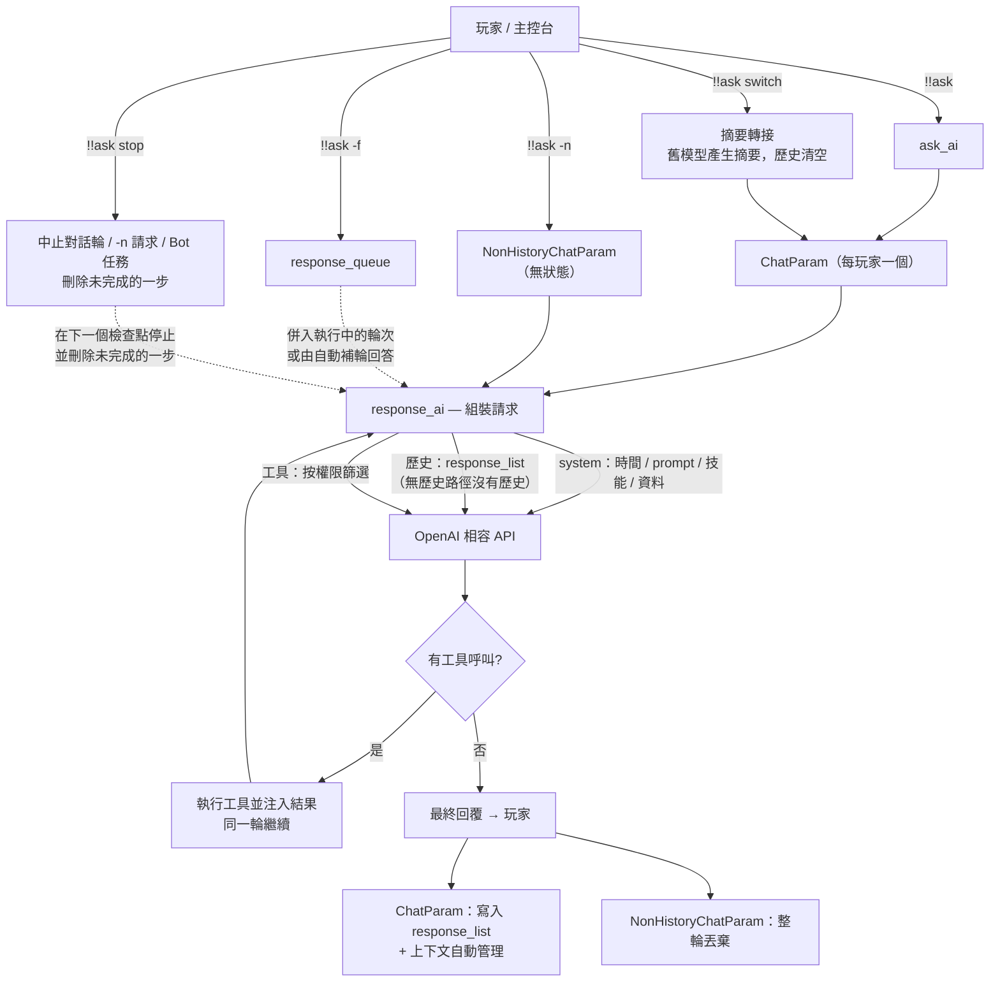
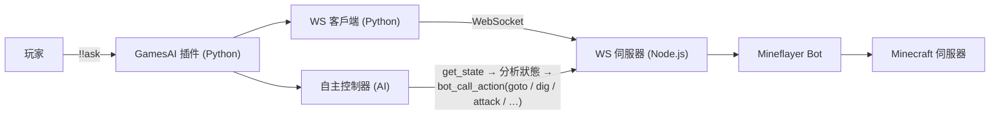

<div align="center">

# GamesAI for MCDReforged

[English](/README.md)  |  [简体中文](/README.zh-CN.md)  |  繁體中文

[回報問題](https://github.com/PengZixuan30/Games_AI/issues/new)  |  [提供想法](https://github.com/PengZixuan30/Games_AI/discussions/new/choose)  |  [加入Q群](https://qm.qq.com/q/jDQQaUPNmw)

[轉至Fabric版本](https://github.com/PengZixuan30/GamesAI)

</div>

> [!NOTE]
> **GamesAI 插件/模組 QQ 交流群：849544707** — 歡迎加入交流群討論問題、回饋建議，以及分享 prompt、skills、tools 等設定！

> [!NOTE]
> 歡迎使用版本 0.7.1！本次更新帶來了**上下文自動管理**：固定的 `max_history` 設定已移除，插件會自動解析各模型的上下文視窗、從服務商回傳的 `usage` 取得真實用量，並且只在上下文確實過大時才壓縮對話（較早的輪次會轉為摘要）。詳見[本次更新](#本次更新)

> [!NOTE]
> **切換模型現在採用「摘要轉接」**（[#20](https://github.com/PengZixuan30/Games_AI/issues/20) 社群投票的方案 B1，已在 v0.7.1 實作）：`!!ask switch <model>` 會先讓**舊模型**把目前對話壓縮成一段中性事實摘要，清空原歷史，再把摘要交給新模型。詳見[切換模型時的摘要轉接](#切換模型時的摘要轉接)。

<details>
<summary>目錄（點擊展開）</summary>

- [GamesAI for MCDReforged](#gamesai-for-mcdreforged)
  - [安裝](#安裝)
  - [使用](#使用)
  - [|`!!data list keys`|讀取公共資料庫中的所有 key。|](#data-list-keys讀取公共資料庫中的所有-key)
  - [AI 請求鏈路與對話機制](#ai-請求鏈路與對話機制)
    - [請求鏈路](#請求鏈路)
    - [無歷史路徑（`!!ask -n`）](#無歷史路徑ask--n)
    - [上下文自動管理](#上下文自動管理)
    - [每玩家狀態](#每玩家狀態)
    - [切換模型時的摘要轉接](#切換模型時的摘要轉接)
    - [停止正在進行的對話](#停止正在進行的對話)
  - [使用 Mineflayer Bot](#使用-mineflayer-bot)
    - [環境需求](#環境需求)
    - [指令](#指令)
    - [工作原理](#工作原理)
    - [支援的操作](#支援的操作)
    - [Bot 控制 AI 工具](#bot-控制-ai-工具)
    - [設定](#設定)
  - [設定](#設定-1)
    - [1.prefix](#1prefix)
    - [2.permission](#2permission)
    - [3.all\_ai](#3all_ai)
    - [4.default\_ai](#4default_ai)
    - [5.mineflayer\_bot](#5mineflayer_bot)
  - [工具與Skills](#工具與skills)
    - [內建工具](#內建工具)
    - [在設定檔案中自訂工具](#在設定檔案中自訂工具)
    - [在自己的MCDR插件中自訂工具](#在自己的mcdr插件中自訂工具)
    - [內建Skills](#內建skills)
    - [在設定檔案中新增Skills](#在設定檔案中新增skills)
    - [在自己的MCDR插件中註冊Skills](#在自己的mcdr插件中註冊skills)
  - [熱重載](#熱重載)
    - [觸發熱重載](#觸發熱重載)
    - [重載期間發生了什麼](#重載期間發生了什麼)
    - [讓自己的 MCDR 插件跟隨 GamesAI 熱重載](#讓自己的-mcdr-插件跟隨-gamesai-熱重載)
      - [方式一：使用 `register_self()` 自動重載（推薦）](#方式一使用-register_self-自動重載推薦)
      - [方式二：透過監聽事件回應熱重載](#方式二透過監聽事件回應熱重載)
    - [兩種方式對比](#兩種方式對比)
  - [故障排除](#故障排除)
    - [`!!ask` 錯誤](#ask-錯誤)
    - [Mineflayer Bot 錯誤](#mineflayer-bot-錯誤)
    - [日誌與除錯](#日誌與除錯)
  - [本次更新](#本次更新)
    - [Version 0.7.1](#version-071)
      - [🎯 核心亮點](#-核心亮點)
      - [1. 上下文自動管理](#1-上下文自動管理)
      - [2. 切換模型時的摘要轉接](#2-切換模型時的摘要轉接)
      - [3. `!!ask -n` 的無狀態路徑](#3-ask--n-的無狀態路徑)
      - [4. 設定與行為變更](#4-設定與行為變更)
      - [5. 其他改進](#5-其他改進)
    - [Version 0.7.0](#version-070)
      - [🎯 核心亮點](#-核心亮點-1)
      - [1. ChatParam：每玩家一個對話物件](#1-chatparam每玩家一個對話物件)
      - [2. 完整請求鏈路](#2-完整請求鏈路)
      - [3. 其他改進與修復](#3-其他改進與修復)
  - [AI 在本專案中的角色](#ai-在本專案中的角色)
  - [致謝與聲明](#致謝與聲明)
  - [贊助與貢獻者名單](#贊助與貢獻者名單)
  - [授權條款](#授權條款)

</details>

## 安裝

在 MCDR 主控台中使用下列指令以安裝插件：

`!!MCDR plugin install games_ai`

---

或者從 [MCDR 插件倉庫](https://mcdreforged.com/plugin/games_ai) 取得並安裝到你的插件目錄中。

如果選擇手動安裝，請先安裝 Python 套件 `openai`、`requests` 和 `websockets`，使用下列指令安裝：

```bash
pip install openai requests websockets
```

## 使用

在任何地方輸入指令 `!!gamesai` 以顯示此插件的所有功能。

|指令|用途|
|---|---|
|`!!gamesai clear`|清除玩家的歷史聊天記錄，歷史聊天記錄與公共資料庫無關。|
|`!!gamesai clearall`|清除所有玩家的歷史聊天記錄，歷史聊天記錄與公共資料庫無關。|
|`!!gamesai reload`|重新載入插件設定檔。詳見[熱重載](#熱重載)|
|`!!gamesai check`|檢查插件更新，並強制刷新上下文視窗表。|
|`!!gamesai speedtest [model]`|測試 API 伺服器連線延遲，不指定模型時測試全部。|
|`!!gamesai config get <key>`|讀取一個設定項的值。|
|`!!gamesai config set <key> <value>`|修改一個設定項的值（自動適配舊值型別，修改後自動觸發[熱重載](#熱重載)）。|

---

你也可以直接輸入 `!!ask` 向 AI 提問、聊天或請它幫你做一些事情。

|指令|用途|
|---|---|
|`!!ask <content>`|向 AI 提問、聊天或請它幫你做一些事情。`<content>` 為你想讓 AI 做的事情或你想問 AI 的問題。|
|`!!ask -n <content>`|向 AI 提問但不使用歷史記錄（當前對話仍會被儲存）。|
|`!!ask -f <content>`|強制提問：不等待目前這輪結束，將訊息併入正在執行的對話輪（別名 `-forced`）。詳見[AI 請求鏈路與對話機制](#ai-請求鏈路與對話機制)。|
|`!!ask switch <model>`|切換目前對話使用的 AI 模型，`<model>` 為 AI_ID 或暱稱。切換時清空歷史，並在你下次提問前由舊模型壓縮為摘要轉接給新模型，詳見[切換模型時的摘要轉接](#切換模型時的摘要轉接)。|
|`!!ask stop`|立即停止你名下所有正在進行的對話：執行中的對話輪（含工具呼叫）、正在進行的 `!!ask -n` 提問、以及你委派給 Bot 的任務。未完成的一步會從歷史中刪除，`!!ask -f` 佇列訊息會被丟棄。詳見[停止正在進行的對話](#停止正在進行的對話)。|

---

輸入 `!!data` 取得有關資料庫指令的資訊。

> [!TIP]
> 更新至 0.3.0 及以上版本時會自動新增資料庫。

|指令|用途|
|---|---|
|`!!data write <key> <value>`|在公共資料庫中新增一筆資料，其中 `<key>` 不可包含空格，`<value>` 可為任意字串。|
|`!!data add <key> <value>`|將 `<value>` 追加到公共資料庫中的 `<key>`，不存在時自動建立新 key。|
|`!!data del <key>`|在公共資料庫中刪除一筆資料，無論 key 是否存在。|
|`!!data read <key>`|讀取公共資料庫中 `<key>` 對應的 `<value>`。|
|`!!data list`|讀取公共資料庫中的所有內容。|
|`!!data list keys`|讀取公共資料庫中的所有 key。|
---

---

## AI 請求鏈路與對話機制

本小節說明從你輸入 `!!ask` 到 AI 回覆之間發生了什麼，以及對話在插件內部是如何管理的。

### 請求鏈路

1. 執行 `!!ask <content>`（或 `!!ask -n <content>` / `!!ask -f <content>`）。
2. 插件解析你的使用者名稱，構建帶 `使用者名稱:` / `訊息:` 標籤的使用者訊息（語言隨目前語言環境）。
3. 你的**單玩家 `ChatParam` 物件**（見 `games_ai/chat_param.py`）按需惰性建立，使用 `all_ai` / `default_ai` 設定的模型。`!!ask -n` 則改用一次性的 `NonHistoryChatParam`，見[無歷史路徑](#無歷史路徑ask--n)。
4. 每一輪，`response_ai` 組裝請求：
   - system 訊息：目前時間、該模型的 prompt、技能列表（內建 + `skills.json` + 外部插件註冊）、公共資料列表；
   - 對話歷史（無歷史路徑不保留任何歷史）；
   - 按你的權限等級篩選後的工具列表。
5. 透過 `openai_api.response_chat` 與 OpenAI 相容 API 通訊：有歷史的物件每個 AI 設定持有一個用戶端，無歷史路徑則按 `base_url` + API Key 複用用戶端。
6. 若 AI 呼叫了工具，插件執行之、注入結果，並**在同一輪內繼續**，直到 AI 給出最終文字回覆。
7. 回覆帶上 AI 名稱前綴發送給你，並寫入歷史；隨後上下文會被自動管理（見[上下文自動管理](#上下文自動管理)）。



### 無歷史路徑（`!!ask -n`）

`!!ask -n <content>` 回答一次提問，不留任何東西。它由 `NonHistoryChatParam` 處理 —— 這是 `games_ai/chat_param.py` 中一個自包含的類別，與有歷史的物件**不共享任何輔助函式、屬性或生命週期**。

**它沒有的東西：**對話歷史（`response_list`）、強制請求佇列、輪次生命週期事件、工具計數、上下文管理（token 估算、用量校準、歷史壓縮與摘要請求），以及任何每玩家狀態 —— 不會寫入 `all_chat_param`，回答送出後物件即被丟棄。

**與一般路徑仍然一致的部分：**

- 相同的 system 訊息（時間、prompt、技能列表、公共資料），以及按你權限等級篩選的同一套工具；
- 工具呼叫仍會被執行並回注，**在同一輪內**繼續，直到 AI 給出最終文字回覆；
- 相同的回覆格式與相同的錯誤回報（HTTP 狀態碼對應 + 服務商 Request ID）。

**兩點值得知道的差異：**

- **單輪超窗保險** —— 沒有歷史可壓縮，所以請求在送出前只做一次整體量測：若超過模型視窗的 **80%**，則把最新一則訊息截斷到剩餘空間（單輪幾乎不可能超窗，但超大的工具結果有可能）。完整的[上下文自動管理](#上下文自動管理)只作用於有歷史的路徑。
- **共享 HTTP 用戶端** —— 用戶端按 `base_url` + API Key 快取（最多 8 個），因此連續 `-n` 不必反覆重建連線池、重複 TLS 握手。服務商回傳的 `usage` 會被讀取但不使用：沒有歷史就沒有可校準的對象。

### 上下文自動管理

GamesAI 不再使用固定的 `max_history` 設定。每次請求都會與模型自身的上下文視窗進行比對，只有在確實需要時才壓縮對話。

**視窗的來源**（優先序由高到低）：

1. `all_ai` 中該 AI 條目的 `context_window` —— 單模型覆寫；
2. 上下文視窗表：從 [`data/context_windows.json`](https://github.com/PengZixuan30/Games_AI/blob/main/data/context_windows.json) 取得（GitHub Raw，jsDelivr 作為第二來源），快取於 `config/games_ai/cache/context_windows.json`，由啟動 / 24 小時更新檢查鏈路刷新 —— 執行 `!!gamesai check` 也會刷新，且無視 24 小時 TTL；
3. 隨插件版本內建的備援表（完全離線可用；由倉庫 JSON 同步產生的模組 `games_ai/context_table_data.py`）；
4. 未知模型使用保守預設值 `32768` token。

**觸發條件**（每次請求**之前**與**之後**都會檢查）：

- 目前上下文達到視窗的 **80%**，或
- 單次請求達到視窗的 **20%**（例如一次讀取日誌產生的超大工具結果）。

**觸發後會發生什麼：**

- 最新的 **10 輪**對話始終原樣保留（1 輪 = 一則使用者訊息及其後續 assistant/tool 訊息）；
- 更早的輪次會被替換為一則中性、事實性的**摘要**（用目前模型產生，且不攜帶工具）。摘要不會模仿先前回覆的風格，既有摘要會併入新摘要；
- 若仍然過大，或摘要失敗，則先截斷超長訊息、再丟棄最舊的輪次作為最後保險 —— 保證下一次請求一定能裝得下。

真實輸入量取自服務商回傳的 `usage` 欄位（`prompt_tokens` / `total_tokens`），本地估算會依 `base_url|model` 與之校準，數輪內即可收斂到真實數值。

執行 `!!gamesai debug` 可在 MCDR 主控台看到視窗、用量、校準係數與每一次壓縮過程。

### 每玩家狀態

- `all_chat_param` 為每個玩家在記憶體中保留一個 `ChatParam`；`!!gamesai clear` / `!!gamesai clearall` 會刪除它們。
- `ChatParam` 擁有：
  - `response_list` — 對話歷史；
  - `system_message` — 每輪重建（時間、prompt、技能、資料）；
  - `response_queue` — `!!ask -f` 等待合併的訊息佇列；
  - `is_stopped` — 輪次生命週期事件（用於序列化每個玩家的輪次）。
- **`!!ask -n` 不保留任何狀態**：它由 `NonHistoryChatParam` 處理，不會註冊進 `all_chat_param`，回答送出後即被丟棄 —— 見[無歷史路徑](#無歷史路徑ask--n)。
- **`!!ask switch <model>`** 會為你的 `ChatParam` 重建 AI 用戶端，並執行**摘要轉接**：切換時立即清空原歷史，並由舊模型在你**下次提問前**把這段對話壓縮成一段中性事實摘要，作為新會話的第一條 system 訊息注入。詳見[切換模型時的摘要轉接](#切換模型時的摘要轉接)。
- **`!!ask -f <content>`** 在輪次仍在執行時將請求入隊：執行中的輪次會合併它並繼續；若輪次恰好在合併前結束，則由自動補輪回答。
- **`!!gamesai debug`** 會將請求流程日誌提升到 INFO 等級顯示在 MCDR 主控台（請求開始/結束、強制請求入隊/合併、工具呼叫）；未開啟時同一批日誌走 DEBUG 等級。

> [!NOTE]
> **社群投票結果：** [issue #20](https://github.com/PengZixuan30/Games_AI/issues/20) 的投票已結束，採用**方案 B1（摘要轉接）**，已在 v0.7.1 實作 —— 新模型的回覆不再被上一個模型的風格帶偏，同時對話中的事實被保留下來。

### 切換模型時的摘要轉接

`!!ask switch <model>` 不是單純保留或清空對話，而是把**事實**轉接過去（方案 **B1**，即 [#20](https://github.com/PengZixuan30/Games_AI/issues/20) 投票選出的方案）。壓縮發生的時機與**自動上下文壓縮完全一致** —— 在下一次請求之前，而不是在指令執行時：

1. 指令執行時：等待執行中的輪次結束 → 保存目前對話與舊模型的快照 → 清空原歷史 → 為新模型重建用戶端與 system 訊息。**不發任何 API 請求**，因此即使對話很長，指令也會立即返回；
2. **你下次提問前**（preflight 階段，與自動壓縮同一位置）：由**舊模型**對快照做一次中性、事實性的總結 —— 討論主題、已確認結論、未完成事項、使用者明確提出的要求（沿用上下文壓縮所用的同一條摘要提示詞，不帶工具，60 秒逾時）；
3. 摘要作為**新會話的第一條 system 訊息**注入，並附上一句提示：讓新模型以自己的設定與風格繼續，不要模仿上一個模型；
4. 隨後正常回答這次提問（上下文中已包含該摘要）。

| 情形 | 行為 | 你會看到 |
|---|---|---|
| 有歷史 | 保存快照、清空歷史、安排轉接 | 「……將在你下次提問前由原模型壓縮為摘要轉接。」 |
| 下次請求前轉接成功 | 摘要成為第一條 system 訊息，本輪照常進行 | 無額外提示（與自動壓縮一樣），僅除錯日誌 |
| 轉接失敗（逾時、報錯、空回覆） | 丟棄舊對話，本輪仍然回答 | 「摘要轉接失敗：上一段對話已丟棄……」 |
| 下次提問前又切換了一次 | 保留最初的快照，並由當時生效的模型只總結一次 | 同上 |
| 尚無歷史 | 無可轉接，永遠不發額外請求 | 一般的「已切換」提示 |
| 切換到的就是目前模型 | 什麼都不動 | 「你目前使用的已經是……」 |

補充說明：

- 切換前會等待正在執行的輪次結束，不會對寫了一半的對話做快照；
- 切換還會重置該對話的工具計數、強制請求佇列與用量／校準計數；
- 摘要請求只在你**真正再次提問時**才產生，每次切換最多一次（逾時 60 秒）。它不會阻塞指令，也不會讓切換失敗；轉接失敗只是讓新對話不帶舊上下文；
- `!!ask stop` 不會取消已安排的轉接：它屬於上一段對話，而不屬於執行中的輪次；`!!gamesai clear` 會連同對話物件一起清除它；
- `-n` 路徑與此無關：只有帶歷史的路徑才做摘要。見[無歷史路徑](#無歷史路徑ask--n)。

### 停止正在進行的對話

`!!ask stop` 會立即中止**你自己**名下所有正在進行的內容：

| 正在進行的內容 | 指令行為 |
|---|---|
| 你的對話輪（模型正在思考，或工具正在執行） | 該輪在下一個檢查點停止，未完成的一步從歷史中刪除，`!!ask -f` 佇列訊息被丟棄 |
| `!!ask -n` 提問 | 放棄該請求，答案直接丟棄（無狀態路徑本就不保留任何內容） |
| 你委派給自治 Bot 的任務 | 佇列中的任務被移除，正在執行它的循環停止並丟棄已產生的內容 |

「未完成的一步」如何刪除：

- 末尾是**工具呼叫組**（請求工具的 assistant 訊息 + 其工具結果）時整組刪除，不會殘留孤立的 tool 訊息；
- 否則刪除**該輪追加的全部訊息** —— 你的訊息、由 `!!ask -f` 合併進來的訊息、注入的技能提示 —— 直到上一則已完成的回答為止，等於這次提問從未發生；
- 若該輪已經產出最終回答，該回答也會被刪除。

補充說明：

- 進行中的 HTTP 請求無法真正中斷，因此該輪會在下一個檢查點停止：下一次請求之前、回應剛返回時，或一批工具呼叫之間 —— 延遲最多一次請求；
- 該指令只作用於你自己的對話（沒有目標參數），也不需要額外權限；
- 目前沒有任何進行中的對話時，回覆「目前沒有進行中的對話。」；
- `!!ask stop` 是字面量指令，因此以 `stop ` 開頭的提問會被當作指令（可改用 `!!ask -n stop ...` 或換個說法）——`switch` 同理。

---

## 使用 Mineflayer Bot

GamesAI 0.6.0 引入了基於 [Mineflayer](https://github.com/PrismarineJS/mineflayer) 的全自主 Minecraft 機器人。AI 可以直接控制機器人在遊戲世界中尋路、挖掘、建造、合成、戰鬥和互動。

### 環境需求

- 伺服器需安裝 **Node.js >= 18** 和 **npm**
- 插件首次啟動時自動安裝 npm 依賴（`mineflayer`、`ws`、`vec3`、`mineflayer-pathfinder`、`mineflayer-mcefly`），並在已安裝的 mineflayer 不支援目前伺服器版本時（例如伺服器升級後）自動刷新依賴
- 一個用於 Bot 的 Minecraft 帳號（Microsoft/Mojang/離線）

### 指令

|指令|用途|
|---|---|
|`!!aibot join`|啟用 Bot 並讓其加入伺服器。|
|`!!aibot leave`|讓 Bot 離開伺服器並停用。|
|`!!aibot set <key> <value>`|設定 Bot 身份（`username`/`password`/`auth`）。|

### 工作原理



插件啟動一個 Node.js 程序執行 WebSocket 伺服器，Python WebSocket 客戶端（插件內建）透過本地連線與其通訊，形成 MCDR 與 Mineflayer Bot 之間的橋樑。Bot 啟動後，**自主 AI 控制器**會定時讀取機器人狀態、檢查聊天訊息，並自主決定執行什麼操作。

### 支援的操作

Bot 支援 20+ 種操作，透過 `bot_call_action` AI 工具呼叫：

|操作|描述|
|---|---|
|`goto`|A* 尋路到座標 `{x, y, z, range?}`|
|`efly`|鞘翅飛行到座標（需裝備鞘翅）|
|`dig`|挖掘指定座標的方塊|
|`place`|在指定位址放置方塊|
|`attack`|按名稱攻擊附近實體，或攻擊最近敵對生物|
|`useOn`|右鍵實體（如村民交易）|
|`equip` / `unequip`|裝備/卸下盔甲或手持物品|
|`mount` / `dismount`|騎乘或離開載具和動物|
|`craft`|合成物品（背包或工作台）|
|`lookAt`|看向座標或直接設定 yaw/pitch|
|`sleep` / `wake`|在床上睡覺或起床|
|`activateBlock`|右鍵方塊（打開儲物箱、按下按鈕）|
|`setControlState`|控制載具移動（前進/後退/跳躍）|
|`viewContainer` / `takeFromContainer` / `putToContainer`|容器管理|
|`openFurnace` / `furnacePutInput` / `furnacePutFuel` / `furnaceTakeOutput`|熔爐操作|
|`nearbyEntities` / `findBlocks` / `getBlock`|世界查詢|
|`stop` / `stopEfly`|停止所有移動或鞘翅飛行|

### Bot 控制 AI 工具

除 `bot_call_action` 外，還有以下專用 AI 工具：

|工具|描述|
|---|---|
|`bot_chat`|讓 Bot 在公共聊天中傳送訊息。|
|`bot_whisper`|讓 Bot 向某個玩家傳送私聊訊息。|
|`bot_get_state`|取得 Bot 完整狀態（30+ 欄位）。|
|`run_mineflayer_bot` / `stop_mineflayer_bot`|啟動或停止 Bot。需要達到設定的 `permission` 權限等級（0.6.4+）。|
|`delegate_to_bot`|將複雜的 Minecraft 任務委派給自主控制器。|

### 設定

完整設定參考見 [6.mineflayer_bot](#6mineflayer_bot)。關鍵要點：

- 將 `mineflayer_bot.enabled` 設為 `true`（或使用 `!!aibot join`）以啟動 Bot
- `mineflayer_bot.bot.username` / `password` / `auth` — Bot 的 Minecraft 登入憑證。**使用者名稱必須匹配 `[a-zA-Z0-9_]+`**（僅限英文字母、數字和底線）。
- `mineflayer_bot.cycle_interval` — 自主 AI 決策間隔（秒）
- `mineflayer_bot.websocket` — 內部設定，除非明確知道用途否則不要修改

> [!NOTE]
> 修改 Bot 設定後，執行 `!!gamesai reload`（或使用 `!!aibot set` / `!!gamesai config set`）即可自動重啟 Bot 並套用新設定。詳見[熱重載](#熱重載)。

## 設定

預設設定檔結構如下：

```json
{
  "prefix": "[GamesAI]",
  "permission": 3,
  "all_ai": {
      "<Your AI ID>":{
          "prompt": "你是一名成熟、穩重的 Minecraft 機器人工具，你的名字叫做「GamesAI」",
          "ai_name": "[GamesAI]",
          "base_url": "<Your API Base URL>",
          "ai_model": "<Your AI Model>",
          "api_key": "<Your API Key>",
          "extra_body": {},
          "context_window": null
      }
    },
  "default_ai": "<Your AI ID>",
  "mineflayer_bot": {
      "enabled": false,
      "cycle_interval": 15.0,
      "websocket": {
          "url": "ws://127.0.0.1:8080",
          "reconnect_interval": 10,
          "timeout": 60
      },
      "bot": {
          "username": "<Your Minecraft Bot Username>",
          "password": "<Your Minecraft Bot Password>",
          "auth": "microsoft"
      }
  }
```

---

以下是每個參數的簡介：

### 1.prefix
值的類型：`str`

預設值：`[GamesAI]`

填入插件的名稱，以在插件的回覆之前加上一個前綴，可包含 Minecraft 格式化程式碼。

### 2.permission
值的類型：`int`

預設值：`3`

執行 `!!data` 等指令所必須達到的權限等級，請參閱 [MCDR 權限相關文件](https://docs.mcdreforged.com/zh-cn/latest/permission.html)。

自 0.6.4 起，該值同時決定向玩家 AI 提供哪些**工具**：`perm` 高於玩家權限等級的工具不會傳給 AI 模型，模型既看不到也無法呼叫。管理資料、技能、自訂工具或啟停 Bot 的內建工具都使用該值（透過 `get_plugin_config_perm`），並在每次請求時即時讀取，重載後立即生效。

### 3.all_ai
值的類型：`dict`

預設值：見檔案

填入所有的 AI 資訊，由多個字典組成，每個字典為一個 AI 模型，字典的鍵即為插件內部的 AI_ID。

**prompt**：此設定用於為每個 AI 編寫提示詞。使用 `> xxx.md` 將提示詞指向 `config/games_ai/prompt/xxx.md` 檔案，不限檔案類型

**ai_name**：此設定與 `prefix` 功能類似，但你需要單獨為每個模型設定，可包含 Minecraft 格式化程式碼。

**base_url**、**ai_model**、**api_key**：與以往的相關設定功能相同，但你需要單獨為每個模型設定。

**extra_body**：請參考各 API 提供商對 `extra_body` 項的說明以編寫。對於 DeepSeek 使用者，想要移植原有 `thinking` 的，直接填寫 `{"thinking": {"type": "enabled"}}`。未填寫時預設 `{}`（空）。

**context_window**（可選）：為該模型覆寫[上下文自動管理](#上下文自動管理)所使用的上下文視窗（單位 token）。留空（`null`）時使用上下文視窗表中的數值。對於視窗極大的模型，可作為成本控制開關，例如 `"context_window": 65536`。

### 4.default_ai
值的類型：`str`

預設值：`<Your AI ID>`

填入當使用者直接使用 `!!ask` 時所使用的模型，應填入 `all_ai` 字典中的某一個鍵（即插件內部的 AI_ID）。若填寫錯誤，將導致無法正常使用 `!!ask` 指令。

### 5.mineflayer_bot
值的類型：`dict`

預設值：見上方

Mineflayer 自主 Bot 代理的設定項。

**enabled**：是否在啟動時拉起 Bot。需要 Node.js >= 18。

**cycle_interval**：自主 AI 決策循環間隔秒數（預設：15.0）。

**websocket**：內部 WebSocket 連線參數 — `url`、`reconnect_interval`、`timeout`。

> [!WARNING]
> WebSocket 的 `url` 中 host **必須**設為 `127.0.0.1`。請確保所選埠號未被佔用——插件會在啟動時自動檢查埠號衝突，若埠號被佔用將自動停用 Bot。
> 除非你明確知道自己在做什麼，否則我們不建議你修改 `websocket` 內的設定。

**bot**：Minecraft 帳號憑證 — `username`、`password`、`auth`（microsoft/mojang/offline）。伺服器位址自動從 `server.properties` 中檢測。

> [!WARNING]
> `username` 必須符合正則表達式 `[a-zA-Z0-9_]+`（僅限英文字母、數字和底線，不含空格）。若使用者名稱包含非法字元，`!!aibot join` 將被拒絕。

> [!TIP]
> 修改設定後，使用 `!!gamesai reload` 或 `!!gamesai config set` 使更改生效。詳見[熱重載](#熱重載)。

## 工具與Skills

> [!TIP]
> 部分工具由 [GamesAI-Extra](https://github.com/PengZixuan30/Games_AI-Extra) 插件提供——座標點管理與位置追蹤，以及（0.6.4 起）白名單管理（`get_whitelist_name`、`add_to_whitelist`、`remove_from_whitelist`）和 `search_minecraft_wiki`。安裝該插件即可獲得這些工具。

### 內建工具

GamesAI 插件提供了許多內建工具，請見下表。如果你想要更多工具，可以選擇[向作者投稿](https://github.com/PengZixuan30/Games_AI/issues/new)、[在設定檔案中自訂工具](#在設定檔案中自訂工具)、或[在自己的MCDR插件中註冊工具](#在自己的mcdr插件中自訂工具)。

<details>
<summary>點擊檢視所有內建工具</summary>

|工具 ID|傳入參數|用途|
|:---:|:---:|:---|
|get_online_players|無|取得伺服器中線上的玩家列表。依賴於 `online_player_api` 插件，RCON 可用時回退為 RCON `list` 查詢。|
|get_player_position|`player`|取得指定玩家的位置和維度。依賴於 `minecraft_data_api` 插件，不存在時自動關閉此工具。|
|calculator|`expression`|簡單的數學表達式計算機。|
|item_caculator|`expression`、`single_limit`|數學表達式計算機，並將最終結果轉換為物品計數法，即「盒、組、個」，自動適應物品的堆疊數，未指定時預設使用 64。|
|ai_read_data|`key`|讀取一筆資料庫內容。|
|ai_read_all_keys|無|取得資料庫中的所有鍵。|
|ai_read_all_data|無|一次性讀取資料庫中所有鍵值對。|
|ai_write_data|`key`、`value`|向資料庫中寫入一筆資料（覆寫模式）。|
|ai_add_data|`key`、`value`|向資料庫中寫入一筆資料（追加模式）。|
|read_skills|`skills`|讀取已註冊的技能指導檔案，引導 AI 執行特定任務。|
|write_skills|`skills`、`summary`、`content`|建立或覆寫一個技能檔案並註冊到技能索引中|
|modify_skills|`skills`、`old_string`、`new_string`、`summary`（可選）|以**正規表達式取代**方式修改已有技能檔案：`old_string` 為 Python 正規表達式（對整份檔案匹配），`new_string` 為取代文字，支援 `\1`、`\g<name>` 反向參照，所有匹配都會被取代。正規表達式無法編譯或匹配不到時，會退回以字面文字取代。傳入 `summary` 會同時更新技能索引。|
|delete_skills|`skills`|刪除一個技能檔案並從技能索引中移除|
|read_custom_tools|無|讀取目前自訂 `tools.py` 檔案的內容|
|modify_custom_tools|`old_string`、`new_string`|以**正規表達式取代**方式修改自訂 `tools.py` 檔案（規則同 `modify_skills`）；改完請呼叫 `reload_plugin`。|
|append_custom_tools|`tools`|向自訂 `tools.py` 檔案末尾追加新工具程式碼|
|setting_timer|`duration`|暫停執行指定秒數後再繼續下一步操作|
|reload_plugin|無|熱重載插件以套用設定、技能和自訂工具的變更，不會遺失聊天記錄。詳見[熱重載](#熱重載)|
|ai_del_data|`key`|刪除資料庫中的一筆資料|
|bot_chat|`message`|讓 Mineflayer 機器人在 Minecraft 聊天中傳送訊息。|
|bot_whisper|`username`, `message`|讓機器人私訊某個玩家。|
|bot_get_state|無|取得機器人完整狀態（30+ 欄位）。|
|bot_call_action|`action`, `params`|向機器人傳送任意指令（goto、dig、place、attack 等）。|
|run_mineflayer_bot|無|啟動 Mineflayer 機器人（如果未執行）。需要達到設定的 `permission` 權限等級。|
|stop_mineflayer_bot|無|停止 Mineflayer 機器人。需要達到設定的 `permission` 權限等級。|
|delegate_to_bot|`task`|將複雜的 Minecraft 任務委派給自主 Bot 控制器。|

> [!NOTE]
> 自 0.6.4 起，`perm` 高於請求玩家權限等級的工具不會提供給 AI。寫入／刪除資料、管理技能、管理自訂工具或啟停 Bot 的工具需要達到設定的 `permission` 權限等級。
>
> 自 0.7.1 起，與工具呼叫相關、傳送給模型的內容全部為英文：工具 schema（名稱、說明、參數）與工具回傳值（含錯誤與權限提示）。發給玩家的進度提示仍保持在地化。

</details>

### 在設定檔案中自訂工具

透過修改 `config/games_ai/tools/tools.py` 檔案來實作自訂工具。

先來看看預設內容：

```python
from mcdreforged.command.command_source import CommandSource
from games_ai.games_ai_tool import register_tool

@register_tool(description="My Custom Tool")
def my_custom_tool(source: CommandSource, ai_prefix: str):
    return "Tool execution completed"
```

> [!IMPORTANT]
> 程式碼中的 `from games_ai.games_ai_tool import register_tool` 和函式定義前的 `@register_tool` 必須存在。

> [!TIP]
> 在 0.5.7+ 版本中，AI 可以**自主讀取、編輯和追加**自訂工具檔案。只需讓 AI 幫你新增工具——它會先讀取目前檔案，用 `old_string` → `new_string` 做精確取代，然後透過 [熱重載](#熱重載) 使修改生效。

`description` 是必填項，告訴 AI 此工具的用途。`parameters` 字典（可選）定義了 AI 應傳入的參數，遵循 [OpenAI function calling 格式](https://platform.openai.com/docs/guides/function-calling)。函式簽名必須包含 `source: CommandSource` 和 `ai_prefix: str` 作為前兩個參數，其後跟隨 `parameters` 中定義的參數。

自 0.6.4 起，可選的 `perm` 參數用於設定向玩家 AI 提供該工具所需的最低權限等級——可以是 `int`，也可以是返回 `int` 的零參可呼叫物件（如 `get_plugin_config_perm`，動態跟隨插件的 `permission` 設定）。預設值為 `0`（所有玩家可用）：

```python
from games_ai.games_ai_tool import register_tool, get_plugin_config_perm

@register_tool(description="管理員專用工具", perm=get_plugin_config_perm)
def my_admin_tool(source: CommandSource, ai_prefix: str):
    return "僅對達到設定權限等級的玩家可見"
```

權限高於玩家等級的工具根本不會傳給 AI；出於安全考量，仍應在函式內部保留 `source.get_permission_level()` 執行時檢查。

> [!TIP]
> 在 `@register_tool` 旁添加 `@register_bot_tool()` 裝飾器（同樣從 `games_ai.games_ai_tool` 匯入），可以讓該工具被自主 Mineflayer Bot 控制器使用。不加則只能透過 `!!ask` 由聊天 AI 呼叫。

### 在自己的MCDR插件中自訂工具

如果你在開發獨立的 MCDR 插件，可以直接在插件程式碼中註冊工具，無需修改 `tools.py`：

```python
from games_ai.games_ai_tool import register_tool, register_bot_tool

@register_tool(
    description="你的自訂工具的描述",
    parameters={...}  # 可選
)
@register_bot_tool()  # 可選 — 讓該工具可被 Mineflayer Bot 控制器使用
def my_plugin_tool(source: CommandSource, ai_prefix: str, ...):
    source.reply(f'{ai_prefix}正在執行我的工具...')
    return "工具執行結果"
```

> [!IMPORTANT]
> 你的插件**必須**在 `mcdreforged.plugin.json` 中將 `games_ai` 的版本依賴設為 `>= 0.4.1`，否則匯入會失敗。如果使用了 `@register_bot_tool()`，最低版本應為 `>= 0.6.0`。

你的插件需要在 `mcdreforged.plugin.json` 中將 `games_ai` 列為依賴，以確保 GamesAI 先載入：

```json
{
    "id": "my_plugin",
    "dependencies": {
        "mcdreforged": ">=2.15.0",
        "games_ai": ">=0.4.1"
    }
}
```

以此方式註冊的工具與內建工具完全相同——AI 可以直接呼叫，如果需要也可以使用 `@register_bot_tool()` 標記為 Bot 可用工具。自 0.6.4 起，可選的 `perm` 參數（`int` 或返回 `int` 的零參可呼叫物件，如 `get_plugin_config_perm`）用於控制工具對哪個權限等級開放。

> [!NOTE]
> 自 0.6.4 起，凡是透過 `@register_tool` 註冊過工具的插件，都會在 `!!gamesai reload` 時**自動重新載入**，其工具程式碼始終保持最新——無需再呼叫 `register_self()`。只有當你的插件需要自訂重載邏輯，或者未註冊工具也想跟隨重載時，才需要使用 `register_self()`。詳見[讓自己的 MCDR 插件跟隨 GamesAI 熱重載](#讓自己的-mcdr-插件跟隨-gamesai-熱重載)。

如果你希望你的插件在 GamesAI 執行 `!!gamesai reload` 時**自動重新載入**——例如插件只註冊了技能（沒有註冊工具），或需要自訂重載邏輯——在你的插件 `on_load` 中呼叫 `register_self()`：

```python
from games_ai.register_extra_plugin import register_self

def on_load(server, old):
    register_self(server.get_self_metadata().id)
```

這樣你的插件會隨 GamesAI 的設定和工具一起重新載入，工具程式碼的修改會立即生效。更多細節見[熱重載](#熱重載)。

### 內建Skills

GamesAI 內建了以下技能檔案，AI 在執行相關操作前會自動讀取：

| 技能檔案 | 描述 |
|---|---|
| `skills_management.md` | 指導 AI 如何正確讀取、寫入、修改和刪除技能檔案。 |
| `custom_tools_management.md` | 指導 AI 如何安全地讀取、編輯和追加自訂工具程式碼 —— 其中包含一條強制步驟：在**動手寫程式碼之前**先向使用者確認需求、參數、權限等級與期望的回傳值。 |
| `mineflayer_bot_guide.md` | 指導 AI 如何操控 Mineflayer 機器人（僅在 Bot 執行時可用）。 |

> [!TIP]
> Skills 就像 AI 的「標準作業程序 (SOP)」——確保 AI 每次都遵循正確的工作流程。

### 在設定檔案中新增Skills

Skills 技能系統讓你可以編寫指導檔案來規範 AI 處理特定任務的方式——例如白名單管理、假人控制等。

技能檔案存放在 `config/games_ai/skills/` 目錄下，格式為 Markdown（`.md`）。要註冊一項技能，編輯 `config/games_ai/skills/skills.json`。以下是一個範例設定（`whitelist.md` 和 `player.md` 僅為範例檔名，並非插件內建檔案）：

```json
[
    {
        "file": "whitelist.md",
        "description": "新增／刪除／查詢白名單時都應讀取此技能檔案"
    },
    {
        "file": "player.md",
        "description": "建立／控制／刪除假人時必須讀取此技能檔案"
    }
]
```

- **`file`** — 技能檔案名稱（相對於 `skills` 資料夾）。
- **`description`** — 展示給 AI 的簡短提示，說明何時應當讀取此技能。

技能註冊後會出現在 AI 的系統提示中。AI 可以使用 **`read_skills`** 工具在執行相關任務前讀取技能檔案的完整內容。

### 在自己的MCDR插件中註冊Skills

你可以從自己的 MCDR 插件中以程式設計方式註冊技能檔案，使其自動出現在 AI 的系統提示中：

```python
from games_ai.external_skills_loader import register_skills

def on_load(server, old):
    register_skills(
        file_name="my_skill.md",
        description="執行 XYZ 操作前應讀取此技能檔案",
        content="""## 我的技能

此技能指導 AI 如何...
- 步驟 1：...
- 步驟 2：...
"""
    )
```

> [!IMPORTANT]
> 你的插件**必須**在 `mcdreforged.plugin.json` 中將 `games_ai` 的版本依賴設為 `>= 0.6.1`。

- **`file_name`** — 技能檔案名稱（AI 的 `read_skills` 工具透過此名稱定位檔案）。
- **`description`** — 展示給 AI 的簡短提示，說明何時應當讀取此技能。
- **`content`** — 技能檔案的完整 Markdown 內容。

以此方式註冊的技能與 `skills.json` 中定義的技能完全相同——它們會出現在 AI 的系統提示中的「Available skills」列表裡，並可透過 `read_skills` 工具讀取。如果你還希望插件在 GamesAI 熱重載時自動刷新，請參考[讓自己的 MCDR 插件跟隨 GamesAI 熱重載](#讓自己的-mcdr-插件跟隨-gamesai-熱重載)。

## 熱重載

GamesAI 提供了完善的熱重載機制，讓你在不重啟伺服器的情況下套用設定、工具和技能的變更。

### 觸發熱重載

熱重載可透過以下方式觸發：

|方式|說明|
|---|---|
|`!!gamesai reload`|管理員手動執行，重新載入全部設定、工具與技能。|
|`!!gamesai config set <key> <value>`|修改設定項後自動觸發重載。|
|AI 工具 `reload_plugin`|AI 在修改工具程式碼或技能檔案後呼叫，確保變更立即生效。|
|`!!aibot set <key> <value>`|修改 Bot 設定後自動觸發重載。|

### 重載期間發生了什麼

執行熱重載時，插件會依次執行以下操作：

1. **重新讀取設定檔** (`config/games_ai/config.json`) — 套用 `prefix`、`permission`、`all_ai`、`default_ai` 等全部設定變更（含單模型 `context_window`）。
2. **全量重建工具註冊（0.6.4+）** — 徹底清空工具註冊表，然後從所有來源重建：內建工具透過註冊重放恢復、自訂 `tools.py` 重新匯入、註冊過工具的插件被重新載入以重新執行註冊程式碼（見第 4、6 步）。
3. **重新載入 Skills** (`config/games_ai/skills/skills.json`) — 刷新技能索引，AI 系統提示中的可用技能列表同步更新。
4. **重新載入自訂工具** (`config/games_ai/tools/tools.py`) — 熱載入自訂工具程式碼，無需重啟 MCDR。
5. **重啟 Mineflayer Bot**（如已啟用）— 停止現有 Bot 程序和 WebSocket 連線，套用新設定後重新啟動。
6. **重載註冊過工具的插件與已註冊的擴展插件** — 重新載入所有透過 `@register_tool` 註冊過工具的第三方插件（0.6.4 起自動追蹤）以及 `REGISTER_PLUGIN_LIST` 中的插件（[見下方](#讓自己的-mcdr-插件跟隨-gamesai-熱重載)）。重載失敗或找不到的插件會從重載列表中移除。
7. **派發 `games_ai.reload` 事件** — 通知所有監聽了此事件的其他 MCDR 插件（[見下方](#透過監聽事件回應熱重載)）。

> [!NOTE]
> 熱重載**不會遺失**玩家的聊天歷史記錄。

### 讓自己的 MCDR 插件跟隨 GamesAI 熱重載

如果你開發了依賴 GamesAI 的 MCDR 插件（例如註冊了自訂工具或技能），你可能希望插件在 GamesAI 熱重載時同步刷新。GamesAI 提供了兩種方式：

#### 方式一：使用 `register_self()` 自動重載（推薦）

這是最簡單的方式。在你的插件 `on_load` 中呼叫 `register_self()`，將插件加入 GamesAI 的重載列表：

> [!NOTE]
> 自 0.6.4 起，透過 `@register_tool` 註冊過工具的插件在熱重載時會自動重新載入（由工具註冊表自動追蹤），因此 `register_self()` 僅適用於未註冊工具的插件（如只註冊技能的插件）或需要自訂重載邏輯的插件。

```python
from games_ai.register_extra_plugin import register_self

def on_load(server, old):
    register_self(server.get_self_metadata().id)
```

每次執行 `!!gamesai reload` 時，你的插件會被 MCDR 自動重載（呼叫 `server.reload_plugin()`）。如果重載失敗，插件會被卸載並從重載列表中移除。

如果你的插件需要**自訂重載邏輯**（不僅僅呼叫預設的 `reload_plugin`），可以傳入自訂 reloader 函式作為第二個參數。除了普通函式外，也可以傳入方法（`self.xxx`）或 lambda 運算式：

```python
from mcdreforged.command.command_source import CommandSource
from games_ai.register_extra_plugin import register_self

def my_reloader(source: CommandSource):
    # 自訂重載邏輯
    server = source.get_server()
    server.logger.info("執行我的自訂重載邏輯...")
    # 例如：重新讀取自己的設定檔、重建資料庫連線等

def on_load(server, old):
    register_self(server.get_self_metadata().id, my_reloader)
```

> [!IMPORTANT]
> 自訂 reloader 函式的**第一個參數必須為 `CommandSource`**（如上例中的 `source`），GamesAI 會將觸發熱重載的命令源傳入該參數。

當自訂 reloader 拋出例外時，插件會被自動卸載並從重載列表中移除，同時在日誌中記錄失敗原因。

#### 方式二：透過監聽事件回應熱重載

如果你的插件不想被卸載/重載，只想在 GamesAI 熱重載完成時收到通知並執行一些邏輯，可以監聽 `games_ai.reload` 事件：

```python
from mcdreforged.api.all import *

def on_load(server: PluginServerInterface, old):
    server.register_event_listener("games_ai.reload", on_gamesai_reload)

def on_gamesai_reload(server: PluginServerInterface):
    server.logger.info("GamesAI 已完成熱重載，我正在同步處理...")
    # 例如：重新讀取 GamesAI 的最新設定
    # 例如：刷新自己快取的工具列表
```

> [!NOTE]
> 事件回呼的第一個參數始終是 `PluginServerInterface`，由 MCDR 自動補齊。

> [!TIP]
> `games_ai.reload` 事件在**重載完成後**派發，所以監聽器拿到的已經是重載後的最新狀態。

### 兩種方式對比

`register_self()` 根據是否傳入第二個參數（自訂 reloader）有不同的行為：

|特性|`register_self()` 不傳 reloader|`register_self()` 傳入自訂 reloader|監聽 `games_ai.reload` 事件|
|---|---|---|---|
|觸發時機|重載過程中（第 6 步）|重載過程中（第 6 步）|重載完成後（第 7 步）|
|插件行為|MCDR 卸載後重載（`on_load` 重新執行）|插件保持載入，僅呼叫自訂函式|插件不受影響|
|失敗處理|插件被卸載，從重載列表移除|插件被卸載，從重載列表移除|例外不會卸載插件|
|工具/Skills|`on_load` 自動重新註冊|無需重新註冊（插件未卸載，註冊保持有效）|無需處理|
|適用場景|插件需要完整刷新程式碼|插件只需重讀設定、刷新快取等輕量操作|插件只需收到通知或同步狀態|

> [!NOTE]
> 註冊在 GamesAI 中的工具（`@register_tool`）和 Skills（`register_skills()`）的生命週期與註冊它們的插件綁定。只要插件未被 MCDR 卸載，已註冊的工具和 Skills 就會一直有效。因此使用自訂 reloader 時**無需**重新註冊。

## 故障排除

### `!!ask` 錯誤

|症狀|可能原因|解決方法|
|---|---|---|
|HTTP 400|請求體格式錯誤|檢查 `extra_body` 格式是否與 API 提供商的要求一致。|
|HTTP 401|API Key 無效|檢查 AI 設定中的 `api_key`。|
|HTTP 404|模型不存在|檢查 `ai_model` 名稱是否正確。|
|HTTP 429|請求頻率過高|稍後重試，或升級 API 方案。|
|逾時/無回應|網路問題或 API 回應慢|使用 `!!gamesai speedtest` 檢查延遲。嘗試更換模型。|
|「未知函式」回覆|AI 呼叫了不存在的工具|通常無害——AI 會重試其他方法。|

### Mineflayer Bot 錯誤

|症狀|相關日誌|解決方法|
|---|---|---|
|Bot 未啟動（完全沒有 `[Mineflayer]` 日誌）|`Mineflayer bot is enabled but Node.js was not found`|安裝 Node.js >= 18。執行 `node --version` 驗證。|
|Bot 在啟動時被停用|`Mineflayer requires Node.js >= 18, but found v{X}`|將 Node.js 升級到 18 或更高版本。|
|Bot 在啟動時被停用|`WebSocket port {X} is already in use!`|在設定檔案中修改 `websocket.url` 為不同埠號，然後 `!!gamesai reload`。|
|`[Bot] Kicked from server` 伴隨認證原因|`[Bot] Kicked from server. Reason:` 後跟認證錯誤|透過 `!!aibot set` 檢查 `username`/`password`/`auth`。Microsoft 認證需確保帳號已遷移。|
|Bot 卡住不動|`goto` 操作回傳 "No path found" 錯誤|`goto` 操作現在會在無路徑時回傳錯誤。嘗試不同的座標。|
|`[Bot] Disconnected` 後自動重新連線|`[Bot] Disconnected. Reason: ...` 後跟 `Reconnecting in 5 seconds...`|伺服器重啟或短暫斷網後的正常行為。Bot 會在 5 秒後自動重新連線。|
|`[Bot] Died, respawning...`|`[Bot] Died, respawning...`|正常——Bot 死亡後會自動重生，無需干預。|
|Bot 不回應指令|日誌中無 `[WS]` 活動|使用 `!!aibot leave` 然後 `!!aibot join` 重新啟動。若持續存在，檢查 `websocket.url` 埠號是否可存取。|
|日誌中出現 `npm install failed`|`npm install failed (exit {X})` 或 `npm is not installed or not in PATH`|確保 npm 已安裝且在 PATH 中。檢查日誌中的詳細錯誤資訊定位具體套件問題。|
|`Server version '{X}' is not supported`|`[Bot] Error: Server version ... is not supported. Latest supported version is ...`|Minecraft 伺服器升級到了已安裝 mineflayer 不支援的版本。插件會自動偵測到此錯誤，更新 npm 依賴並重啟 Bot。若錯誤持續存在，請檢查伺服器能否存取 npm 源，或在 `config/games_ai/mineflayer/` 下手動執行 `npm install --no-save mineflayer ws vec3 mineflayer-pathfinder mineflayer-mcefly`，然後透過 `!!aibot leave` / `!!aibot join` 重啟 Bot。|

### 日誌與除錯

- 啟用除錯模式：`!!gamesai debug` — 顯示完整 AI 提示詞和工具呼叫結果。
- Mineflayer Bot 日誌在 MCDR 主控台以 `[Mineflayer]` 前綴顯示。
- OpenAI SDK HTTP 日誌自動路由至 MCDR 主控台（詳見 [OpenAI 日誌橋接](#3-openai-日誌橋接)）。
- 如果以上方法均無效，請檢查 `config/games_ai/config.json` 是否存在設定錯誤。

## 本次更新

### Version 0.7.1

#### 🎯 核心亮點

- **🧮 上下文自動管理** — 固定的 `max_history` 設定已移除。插件會自動解析各模型的上下文視窗、從服務商回傳的 `usage` 取得真實用量，並且只在上下文確實過大時才壓縮對話。
- **🔀 `!!ask switch` 的摘要轉接** — [#20](https://github.com/PengZixuan30/Games_AI/issues/20) 社群投票選出**方案 B1**：切換時立即清空原歷史，由**舊模型**在你下次提問前把它壓縮成一段中性事實摘要（與自動上下文壓縮同一時機）—— 切換不再阻塞，新模型拿到事實而不沾舊風格。
- **🛑 `!!ask stop`** — 一次停止你名下所有正在進行的內容：執行中的對話輪（含工具呼叫）、正在進行的 `!!ask -n` 提問、以及委派給 Bot 的任務。未完成的一步會從歷史中刪除，不會留下寫了一半的對話。
- **🪶 無狀態的 `!!ask -n`** — 單次提問不再建立（然後丟棄）一個完整的對話物件：`NonHistoryChatParam` 不保留歷史、佇列與上下文記帳，並按端點複用同一個 HTTP 用戶端。
- **📊 請求用量感知** — `response_chat` 現在會回傳服務商的 `usage`，插件因此能掌握每次請求的真實輸入量，並依 `base_url|model` 校準本地估算。
- **🧩 新增 `context_window` 選項** — `all_ai` 中每個 AI 可選填的視窗覆寫值，對於視窗極大的模型可作為成本控制開關。

#### 1. 上下文自動管理

每次請求都會與模型自身的上下文視窗比對，只有確實需要時才壓縮對話。完整說明見[上下文自動管理](#上下文自動管理)。

- **視窗來源**：單模型 `context_window` → 遠端表 [`data/context_windows.json`](https://github.com/PengZixuan30/Games_AI/blob/main/data/context_windows.json)（GitHub Raw，jsDelivr 備用，快取 24 小時）→ 版本內建表 → 保守預設值（`32768`）。
- **觸發條件**（每次請求**前後**都會檢查）：目前上下文達到視窗 **80%**，或單次請求達到視窗 **20%** —— 後者用於捕捉「一次讀取大日誌」這類突發成長。
- **壓縮方式**：最新 **10 輪**始終原樣保留；更早的輪次替換為一則中性事實摘要（由目前模型產生，不帶工具）。若仍不足，則截斷超長訊息並丟棄最舊輪次，保證下一次請求一定能裝得下。
- **校準**：本地 token 估算會依 `base_url|model` 與真實 `usage` 對齊，數輪內收斂。

#### 2. 切換模型時的摘要轉接

`!!ask switch <model>` 現在實作 [#20](https://github.com/PengZixuan30/Games_AI/issues/20) 投票選出的**方案 B1**（投票已結束）：

- 摘要請求被**延後**，與自動上下文壓縮完全一致：指令只負責清空歷史並保存快照，由**舊模型**在你**下次請求之前**寫出中性事實摘要（討論主題、已確認結論、未完成事項、使用者明確要求 —— 不帶工具、60 秒逾時）。因此切換會立即返回，不再被摘要請求阻塞；
- 原歷史在切換時即被清空，舊模型回覆不再影響新模型的口氣與人設；
- 摘要作為新會話的第一條 system 訊息注入，並附帶「請以自己的設定與風格繼續」的提示；
- 延後的摘要失敗時本輪仍會正常回答，並告知玩家上一段對話已被丟棄；
- 切換到目前已在使用的模型不會改動任何東西；沒有歷史時也不會多發請求；
- 切換前會等待執行中的輪次結束，並重置工具計數、強制請求佇列與用量計數。

詳見[切換模型時的摘要轉接](#切換模型時的摘要轉接)。

#### 3. `!!ask -n` 的無狀態路徑

單次提問過去會建立一個完整的 `ChatParam`（歷史、佇列、生命週期事件、校準狀態、上下文管理），回答完就丟棄。現在改由 `NonHistoryChatParam` 處理 —— 一個自包含、什麼都不保留的類別：

- **不保留任何狀態** —— 整輪只活在 `response_ai` 內部，回傳即釋放；不會註冊進 `all_chat_param`，沒有歷史、佇列、`is_stopped` 事件與工具計數；
- **不做上下文管理** —— 不做 token 估算、不做用量校準、不壓縮歷史，因此也不會產生額外的摘要請求；
- **回答完全一致** —— 與一般路徑相同的 system 訊息、相同的按權限篩選工具、相同的回覆格式與錯誤回報；工具呼叫同樣在同一輪內執行並回注；
- **單輪超窗保險** —— 若整個請求超過模型視窗的 80%，則把最新一則訊息截斷到剩餘空間（有歷史的路徑仍然使用完整的上下文管理）；
- **共享 HTTP 用戶端** —— 用戶端按 `base_url` + API Key 快取，連續 `-n` 不必每次都重建連線池並重做 TLS 握手。

細節見[無歷史路徑](#無歷史路徑ask--n)。

#### 4. 設定與行為變更

- **`max_history` 已移除** —— 舊設定檔仍可正常使用，該鍵會被直接忽略。
- **新增 `context_window`**（可選，位於每個 AI 條目內）—— 見 [3.all_ai](#3all_ai)。
- **新增遠端表** —— `data/context_windows.json` 在本倉庫維護（**249 條**，涵蓋 19 家廠商與各託管平台，核驗日期 2026-09-11；來源與口徑見 [`data/context_windows.sources.md`](https://github.com/PengZixuan30/Games_AI/blob/main/data/context_windows.sources.md)）。插件在啟動時與 24 小時更新檢查時取得，並快取到 `config/games_ai/cache/context_windows.json`；`!!gamesai check` 會無視 24 小時 TTL 強制刷新。維護者可編輯該 JSON 後執行 `python tools/build_context_table.py` 重新同步內建表並校驗。
- **刷新鏈路合併為一條** —— 視窗表刷新與啟動 / 24 小時更新檢查共用同一條執行緒，不再另外多起一條；並發刷新也不會重複下載兩次表。

#### 5. 其他改進

- `response_chat` 新增單次請求 `timeout`，並回傳 `(message, usage)`；
- 新增 `context_table` 模組：表匹配、校驗、快取與靜默離線備援；版本內建表改放在生成式模組 `games_ai/context_table_data.py`（每條一行），不再內聯在邏輯模組裡；
- **內建工具的文字已全部英文化** —— 26 個內建工具的 `description` 與參數說明，**以及回傳給模型的工具回傳值**（執行結果、錯誤與權限提示）均為英文，函式呼叫提示詞不再混用中英；只有發給玩家的提示仍保持在地化；
- **`modify_skills` 與 `modify_custom_tools` 改為編輯而非整體重寫** —— 兩者都接收 `old_string`（Python 正規表達式）與 `new_string`（支援 `\1` 等反向參照），取代所有匹配而不是覆寫整個檔案。正規表達式無法編譯或匹配不到時退回字面文字取代；完全匹配不到則不寫入任何內容並明確告知模型。`modify_skills` 仍保留可選參數 `summary`，用於同步技能索引；
- `!!gamesai debug` 會輸出視窗、用量、校準係數與每一次壓縮過程；
- **新增 `!!ask stop` 指令** —— 在下一個檢查點中止該玩家執行中的對話輪（進行中的請求無法真正中斷），從歷史中刪除未完成的一步，丟棄 `!!ask -f` 佇列訊息，同時也會停止正在進行的 `!!ask -n` 提問與委派給自治 Bot 的任務。詳見[停止正在進行的對話](#停止正在進行的對話)；
- 未對應的 HTTP 錯誤碼兜底文案改為翻譯鍵（`games_ai.error_code_map.error_unknown`），與其他錯誤碼一樣跟隨玩家語言；
- `custom_tools_management` 技能新增強制的「Step 0」：AI 必須**在撰寫任何工具程式碼之前**先向使用者確認需求、參數、權限等級與期望回傳值，並對有風險或不可逆的行為再次確認。

### Version 0.7.0

#### 🎯 核心亮點

- **🧠 每玩家 ChatParam 架構** — 每個玩家的對話現在由一個專屬 `ChatParam` 物件管理：它擁有對話歷史、系統訊息、強制請求佇列與輪次生命週期事件。歷史處理、模型切換、強制提問都經由該物件。
- **🔀 模型切換：`!!ask switch <model>`** — 隨時切換目前對話使用的 AI 模型。0.7.0 暫時**完全保留歷史**；處理策略已由 [#20](https://github.com/PengZixuan30/Games_AI/issues/20) 社群投票決定（方案 B1，摘要轉接），並在 0.7.1 實作。
- **⚡ 強制提問：`!!ask -f <content>`** — 在輪次仍在執行時插入問題：訊息會被合併進執行中的輪次（或由自動補輪回答），無需等待上一個回覆結束。
- **🗑️ 移除的指令** — `!!ask -m <model> <content>`、`!!ask --model ...` 及其 `-n` / `--no-history` 組合已被移除；請改用 `!!ask switch <model>` + `!!ask -n <content>`。
- **📋 除錯日誌** — `!!gamesai debug` 現在可以讓完整的 AI 請求流程在 MCDR 主控台可見（模型切換、強制請求入隊/合併、輪次生命週期、工具呼叫）。
#### 1. ChatParam：每玩家一個對話物件

`games_ai/chat_param.py` 引入 `BasicChatParam` / `ChatParam`：

- `response_list` — 該玩家的對話歷史；
- `system_message` — 每輪重建（目前時間、prompt、技能列表、公共資料）；
- `response_queue` — 等待合併的 `!!ask -f` 訊息；
- `is_stopped` — 輪次生命週期事件，用於序列化每個玩家的輪次；
- `trim_response_list()` — 有界歷史（`max_history × 2 + tool_count × 2`，已於 0.7.1 由上下文自動管理取代）；
- `reload_ai_info()` — `!!gamesai reload` 後刷新 AI 設定與使用者端。

所有玩家物件保存在 `all_chat_param` 中；`!!gamesai clear` / `!!gamesai clearall` 會刪除它們。

#### 2. 完整請求鏈路

`!!ask <content>` → `ask_ai` 構建使用者訊息 → 玩家的 `ChatParam` → `response_ai` 組裝請求（system 訊息 + 歷史 + 按權限篩選的工具）→ 經複用的使用者端（`openai_api.response_chat`）存取 OpenAI 相容 API → 回覆發送給玩家；工具呼叫被執行並回填，直到 AI 給出最終文字回覆。詳見[AI 請求鏈路與對話機制](#ai-請求鏈路與對話機制)。

#### 3. 其他改進與修復

- `!!ask switch <model>` 現在附帶本地化確認訊息，並就地更新對話（0.7.0 保留歷史）；
- `response_chat` 改為注入 `OpenAI` 使用者端（每個 AI 設定一個）並附帶型別檢查；Mineflayer 自主控制器已適配新簽名；
- `!!gamesai reload` 會刷新既有 `ChatParam` 物件（重建使用者端），並在熱重載路徑中刷新 `AutonomousBotController` 設定；
- 強制請求流程有了完整的除錯日誌（入隊、合併、補輪）。

## AI 在本專案中的角色

GamesAI 本身是 AI 驅動的插件，而 AI 也在本專案自身的維護中扮演重要角色：

1. 本 README 最初由作者（yello）排版，後全部交由 AI 修改；
2. 所有翻譯檔案（`lang/*.yml`）均由 AI 修改；
3. 每次發布前的邏輯檢查由 AI 完成；
4. 快照/開發版本中出現的問題將由 AI 排查；
5. GitHub 回饋的 issue、PR 等將先由 AI 排查問題，再交由維護者處理。

## 致謝與聲明

特別感謝 [WangHai Server](https://github.com/Wanghai-Server) 為此插件的測試提供了基礎。

特別感謝 [william-song-shy (William Song)](https://github.com/william-song-shy) 為 `!!ask` 無歷史模式提供的建議。

特別感謝 [ZhangZuoqian (張作乾)](https://github.com/ZhangZuoqian) 為測速指令提供的建議。

AI（LLM）模型生成的一切內容與此插件無關。

自訂工具造成的一切後果與本插件無關。

## 贊助與貢獻者名單

贊助地址：[愛發電](https://ifdian.net/a/yello)

為GamesAI贊助的將會出現在下列的贊助者名單中（當前沒有贊助者）：

| # | 贊助者 | 金額 | 日期 |
|---|--------|------|------|
| - | - | - | - |

## 授權條款

MIT 授權條款，版權所有 (c) 2026 yello

<div align = "center">

---

[回到頂端](#gamesai-for-mcdreforged)

</div>
