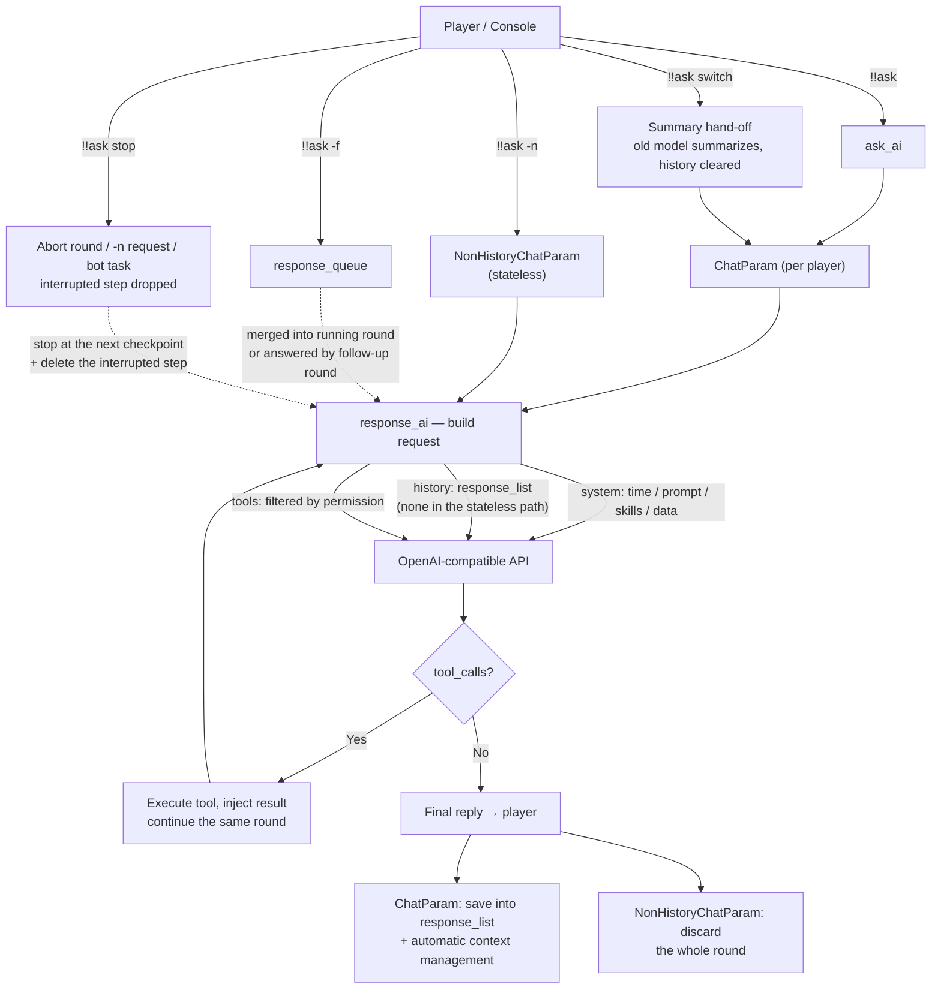

# AI Request Pipeline & Chat Mechanism

English  |  [简体中文](../zh_cn/ai-request-pipeline.md)  |  [繁體中文](../zh_tw/ai-request-pipeline.md)

[Back to README](../../README.md)

This section explains what happens between your `!!ask` and the AI's reply, and how conversations are managed internally.

## The request chain

1. You run `!!ask <content>` (or `!!ask -n <content>` / `!!ask -f <content>`).
2. The plugin resolves your username and builds the user message (labeled with `Username:` / `Message:` in your current language).
3. Your per-user `ChatParam` object (see `games_ai/chat_param.py`) is created lazily and uses the model configured by `all_ai` / `default_ai`. `!!ask -n` uses a throwaway `NonHistoryChatParam` instead — see [The stateless path](#the-stateless-path-ask--n).
4. Each round, `response_ai` assembles the request:
   - system messages: current time, the model's prompt, the skills list (built-in + `skills.json` + registered by external plugins), and the public data list;
   - conversation history (the stateless path keeps none);
   - tools filtered by your permission level.
5. The round talks to the OpenAI-compatible API through `openai_api.response_chat`. A history object owns one client per AI config; the stateless path reuses a client per `base_url` + API key.
6. If the AI calls a tool, the plugin executes it, injects the result, and **continues the same round** until the AI produces a final text reply.
7. The reply is sent with the AI's name prefix and saved into the history; the context is then managed automatically (see [Automatic Context Management](#automatic-context-management)).

## The stateless path (`!!ask -n`)

`!!ask -n <content>` answers one question and keeps nothing. It is served by `NonHistoryChatParam`, a self-contained class in `games_ai/chat_param.py` that shares no helper, attribute or lifecycle with the history objects.

**What it does not have:** dialogue history (`response_list`), the forced-request queue, the round lifecycle event, the tool counter, context management (token estimation, usage calibration, history compression, summarization requests) and any per-user state — nothing is stored in `all_chat_param`, and the object is discarded as soon as the answer is sent.

**What still matches the normal path:**

- the same system messages (time, prompt, skills list, public data) and the same tools for your permission level;
- tool calls are still executed and fed back **inside the same round**, until the AI produces a final text reply;
- the same reply format and the same error report (HTTP status mapping plus the provider's request ID).

**Two differences worth knowing:**

- **Single-round window guard** — with no history to compress, the request is simply measured before it is sent: if it would exceed **80 %** of the model's window, the newest message is truncated to the remaining room (a single round can hardly overflow a window; an oversized tool result can). The full machinery of [Automatic Context Management](#automatic-context-management) applies to the history path only.
- **Shared HTTP client** — clients are cached per `base_url` + API key (at most 8 of them), so repeated `-n` calls neither rebuild a connection pool nor repeat a TLS handshake. Provider `usage` is read but ignored, because without history there is nothing to calibrate.

## Automatic Context Management

GamesAI no longer uses a fixed `max_history` value. Instead, every request is measured against the model's own context window and the conversation is compressed only when it is actually needed.

**How the window is resolved** (highest priority first):

1. `context_window` in the AI entry of `all_ai` — per-model override;
2. the context-window table: fetched from [`data/context_windows.json`](https://github.com/PengZixuan30/Games_AI/blob/main/data/context_windows.json) (GitHub Raw, with jsDelivr as a second source), cached at `config/games_ai/cache/context_windows.json`, refreshed by the startup / 24 h update-check chain — and by `!!gamesai check`, which bypasses the 24 h TTL;
3. a table bundled with the plugin version (works fully offline; generated module `games_ai/context_table_data.py`, synced from the repository JSON);
4. a conservative default of `32768` tokens for unknown models.

**Triggers** (checked before *and* after every request):

- the current context has reached **80 %** of the window, or
- a single request has reached **20 %** of the window (for example a huge tool result such as a log file).

**What happens when a trigger fires:**

- the newest **10 rounds** are always kept verbatim (one round = one user message plus its assistant/tool messages);
- older rounds are replaced by a single neutral, factual **summary** (generated with the current model, without tools). Summaries do not imitate the previous replies' style, and an existing summary is merged into the new one;
- if the conversation is still too large, or the summary fails, oversized messages are truncated and the oldest rounds are dropped as a last resort — the next request always fits.

The real input size comes from the provider's own `usage` field (`prompt_tokens` / `total_tokens`), and the local estimate is calibrated against it per `base_url|model`, so estimates converge to the real numbers within a few rounds.

Run `!!gamesai debug` to see the window, usage, calibration factor and every compression step in the MCDR console.

## Per-user state

- `all_chat_param` keeps one `ChatParam` per player in memory; `!!gamesai clear` / `!!gamesai clearall` removes them.
- `ChatParam` owns:
  - `response_list` — the dialogue history;
  - `system_message` — rebuilt every round (time, prompt, skills, data);
  - `response_queue` — messages from `!!ask -f` waiting to be merged;
  - `is_stopped` — the round lifecycle event (used to serialize rounds per player).
- **`!!ask -n` keeps no state at all**: it is served by `NonHistoryChatParam`, which is not registered in `all_chat_param` and is dropped when the answer has been sent — see [The stateless path](#the-stateless-path-ask--n).
- **`!!ask switch <model>`** rebuilds the AI client of your `ChatParam` with a **summary hand-off**: the raw history is cleared right away, and the old model compresses it into one neutral factual summary **right before your next request** (same timing as automatic context compression), which is then injected as the first system message of the new session. See [Summary Hand-off on Model Switch](#summary-hand-off-on-model-switch).
- **`!!ask -f <content>`** queues the request while a round is still running: the in-flight round merges it and keeps going; if the round just ended before the merge, an automatic follow-up round answers it.
- **`!!gamesai debug`** switches the request-flow logs to INFO level in the MCDR console (request start/finish, forced-request queue/merge, tool calls); without it, the same logs go to DEBUG.

> [!NOTE]
> **Community vote result:** the poll in [issue #20](https://github.com/PengZixuan30/Games_AI/issues/20) is closed. Option **B1 (summary hand-off)** is implemented in v0.7.1 — the previous model's style no longer shapes the new model's replies, while the facts of the conversation are carried over.

## Summary Hand-off on Model Switch

`!!ask switch <model>` does not simply keep or wipe the conversation; it hands the facts over (option **B1**, the winning design of the poll in [#20](https://github.com/PengZixuan30/Games_AI/issues/20)). The compression runs at the **same moment as the automatic context compression** — right before the next request, never inside the command:

1. on the command itself: the switch waits for a running round to finish, keeps a snapshot of the conversation together with the old model, clears the raw history, and rebuilds everything for the new model. No API call is made, so the command returns instantly — even for a very long conversation;
2. **right before your next request** (in the preflight pass, exactly like automatic compression): the **old** model is asked for one neutral, factual summary of that snapshot — topic, settled conclusions, open items, and any explicit user requirements (the same summarization prompt as context compression, sent without tools, 60 s timeout);
3. the summary is injected as the **first system message of the new conversation**, wrapped in a note that tells the new model to continue with its own instructions and style and not to imitate the previous one;
4. the question you asked is then answered normally, with the summary in context.

| Situation | What happens | What you see |
|---|---|---|
| History exists | Snapshot kept, history cleared, hand-off scheduled | "…will be compressed into a summary by the old model right before your next question." |
| Hand-off succeeds before the next request | Summary becomes the first system message, then the round runs | Nothing extra (like automatic compression), only debug logs |
| Hand-off fails (timeout, error, empty reply) | The old conversation is dropped, the round still runs | "The summary hand-off failed: the previous conversation was dropped…" |
| Switching twice before the next request | The original snapshot is kept and summarized once, by the model that was active when it was taken | Same as above |
| No history yet | Nothing to hand over, no extra request ever | Plain "switched" message |
| Already using that model | Nothing is touched | "You are already using AI model…" |

Notes:

- the switch waits for a running round to finish first, so a snapshot is never taken from a half-written conversation;
- switching also resets the tool counter, the forced-request queue and the usage/calibration counters of the conversation;
- the extra summarizing request is only paid when you actually ask again — and only once per switch (with a 60 s timeout). It never blocks the command and never fails the switch; a failed hand-off just leaves the new conversation without the old context;
- `!!ask stop` does not cancel a scheduled hand-off: it belongs to the previous conversation, not to the running round. `!!gamesai clear` removes it together with the conversation object;
- using `-n` costs nothing here: only the history path summarizes. See [The stateless path](#the-stateless-path-ask--n).

## Stopping a Running Round

`!!ask stop` aborts everything **you** have in flight, right away:

| What is running | What the command does |
|---|---|
| A round of your conversation (the model is thinking, or tools are executing) | The round stops at its next checkpoint, the interrupted step is deleted from the history, and queued `!!ask -f` messages are discarded |
| A `!!ask -n` request | The request is abandoned; its answer is thrown away (the stateless path keeps nothing anyway) |
| A task you delegated to the autonomous bot | The queued task is removed, and the cycle executing it stops and discards what it produced |

How the interrupted step is deleted:

- a trailing **tool-call group** (the assistant message that requested the tools plus its tool results) is removed as a whole, so no orphan tool message is left behind;
- otherwise **everything the interrupted round appended** is removed — your message, messages merged from `!!ask -f`, injected skill notes — stopping at the last completed answer, so an interrupted ask never happened;
- if that round had already produced its final answer, that answer is removed too.

Details:

- an in-flight HTTP request cannot be cancelled, so the round stops at the next checkpoint: before the next request, right after the response arrives, or between two tool calls of a batch. The delay is therefore at most one request;
- the command only ever touches your own conversations (no target argument), and needs no special permission;
- with nothing running it answers "There is no conversation in progress.";
- `stop` must be **exactly that one word** to act as a command: a sentence such as `!!ask stop it.` is handed to the model unchanged (since 0.7.2 `!!ask` is parsed by a command dispatcher; see the [Context Inspection](#context-inspection) section below).

## Context Inspection

0.7.2 adds three read-only commands that turn context management from invisible into visible. None of them writes any state or starts a round, so they are always safe to run.

| Command | Purpose |
|---|---|
| `!!ask context [player]` | Show the context usage of one conversation (your own when no player is given) |
| `!!ask context --all` | Sum the usage of every player on the server, grouped by model |
| `!!ask compact` | Compress the older history now, ignoring the window triggers |

### One conversation: `!!ask context [player]`

The chat lines are a short summary; the details live on hover:

- **model and window source** — `config override` (the `context_window` of that AI entry), `model table` (a hit in the bundled/remote table) or `default` (the conservative fallback when the table has nothing). The source is otherwise invisible, and an override silently beating the table is the most common reason a displayed window looks wrong;
- **context in use** — the calibrated estimate and its share of the window; with no request sent yet it says so instead;
- **window and output limits** — the resolved `context_window` and `max_output` of that model;
- **how many tokens are left before compression triggers**, and which line will be hit first (history 80% / burst 20% / emergency 95%);
- **round and message counts**, how many summaries the history already carries, whether a model-switch hand-off summary is present, and how many `!!ask -f` messages are waiting to be merged.

The hover adds: the exact token values of the three lines, the **per-round token sizes** (oldest first, with their share of the window, at most 10 rows), the **last request's usage** (prompt/completion/total, cache hits, reasoning) with this round's totals, and the **last compression** (time and message counts before/after).

Inspecting is read-only but must be **mutually exclusive with the round thread**: a running round keeps appending messages, and a compression replaces the whole history list. The snapshot is therefore taken under one lock, so you see either the state before or after a compression, never a half-rewritten history. Inspecting **never creates** a conversation object: a player who never asked simply gets "no context recorded for that player" (which also notes that `!!ask -n` keeps no context at all).

### Server-wide totals: `!!ask context --all`

- grouped by **model**, one line each: player count, total context in use and its share of the window, total round prompt, total round peak;
- the hover shows that model's totals **since the plugin was loaded**: prompt, completion, total, cache hits (0.1% resolution) and reasoning;
- **models with zero usage are not listed**;
- no player names, and no permission restriction.

Two things that are easy to misread:

1. **"context in use" shrinks** — compressing the history or running `!!ask clear` makes it drop; to see what has been spent in total, read the accumulators on hover;
2. **the accumulators start at this plugin load** — they are in-memory counters, so earlier conversations cannot be reconstructed, and a compression never lowers them. That is exactly their purpose: compressing erases the traces in the history, but not the bill that was already paid.

### On-demand compression: `!!ask compact`

It uses the very same logic as automatic compression (the newest **10 rounds** are kept verbatim, older ones are replaced by one neutral summary); the only difference is that it **ignores the triggers**, so it compresses on request even when the context is far from the 80% line.

Like the model-switch hand-off it is **deferred**: the command only records the intent and returns at once, and the actual summarizing request is sent by the preflight of your **next question**. The reason is that this request can take up to 60 seconds, which would block the server's main thread if it ran inside the command — and the round that needs the smaller context is the next one anyway.

The reply therefore only says that compression is *scheduled*. The other two outcomes are reported just as honestly: there is no history to compact, or a round is in progress (the request is then refused, because replacing the history mid-round would split the tool-call group being executed — wait for it or use `!!ask stop` first).

---
