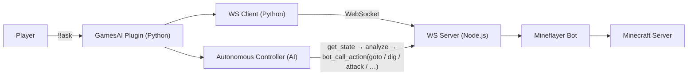

# Using the Mineflayer Bot

English  |  [简体中文](../zh_cn/mineflayer-bot.md)  |  [繁體中文](../zh_tw/mineflayer-bot.md)

[Back to README](../../README.md)

GamesAI 0.6.0 introduces a fully autonomous Minecraft bot powered by [Mineflayer](https://github.com/PrismarineJS/mineflayer). The AI can directly control the bot to navigate, mine, build, craft, fight, and interact with the world.

## Prerequisites

- **Node.js >= 18** and **npm** must be installed on the server
- The plugin automatically installs npm dependencies (`mineflayer`, `ws`, `vec3`, `mineflayer-pathfinder`, `mineflayer-mcefly`) on first launch, and refreshes them automatically when the installed mineflayer does not support the server version (e.g. after a Minecraft server upgrade)
- A Minecraft account for the bot (Microsoft/Mojang/offline)

## Commands

|Command|Description|
|---|---|
|`!!aibot join`|Enable the bot and make it join the server.|
|`!!aibot leave`|Make the bot leave the server and disable it.|
|`!!aibot set <key> <value>`|Configure bot identity (`username`/`password`/`auth`).|

## How It Works

The plugin launches a Node.js process running a WebSocket server. A Python WebSocket client (built into the plugin) connects to it locally, forming a bridge between MCDR and the Mineflayer bot. When the bot is enabled, an **autonomous AI controller** periodically reads the bot's state, checks chat messages, and decides what actions to take.

## Supported Actions

The bot supports 20+ actions callable via the `bot_call_action` AI tool:

|Action|Description|
|---|---|
|`goto`|A\* pathfinding to coordinates `{x, y, z, range?}`|
|`efly`|Elytra flight to coordinates (requires elytra)|
|`dig`|Break a block at coordinates|
|`place`|Place a block at coordinates|
|`attack`|Attack a nearby entity by name or nearest hostile|
|`useOn`|Right-click an entity (e.g. villager trading)|
|`equip` / `unequip`|Equip/unequip armor or items to hand|
|`mount` / `dismount`|Ride or dismount vehicles and animals|
|`craft`|Craft items (inventory or crafting table)|
|`lookAt`|Look at coordinates or set yaw/pitch directly|
|`sleep` / `wake`|Sleep in a bed or wake up|
|`activateBlock`|Right-click a block (open chest, press button)|
|`setControlState`|Control vehicle movement (forward/back/jump)|
|`viewContainer` / `takeFromContainer` / `putToContainer`|Container management|
|`openFurnace` / `furnacePutInput` / `furnacePutFuel` / `furnaceTakeOutput`|Furnace operations|
|`nearbyEntities` / `findBlocks` / `getBlock`|World query|
|`stop` / `stopEfly`|Stop all movement or elytra flight|

## AI Tools for Bot Control

In addition to `bot_call_action`, these dedicated AI tools are available:

|Tool|Description|
|---|---|
|`bot_chat`|Make the bot send a message in public chat.|
|`bot_whisper`|Make the bot send a private message to a player.|
|`bot_get_state`|Get the bot's full state (30+ fields).|
|`run_mineflayer_bot` / `stop_mineflayer_bot`|Start or stop the bot. Require the configured `permission` level (0.6.4+).|
|`delegate_to_bot`|Delegate a complex Minecraft task to the autonomous controller.|

## Configuration

See [5.mineflayer_bot](configuration.md#5mineflayer_bot) for the full configuration reference. Key points:

- Set `mineflayer_bot.enabled` to `true` (or use `!!aibot join`) to launch the bot
- `mineflayer_bot.bot.username` / `password` / `auth` — the bot's Minecraft credentials. **Username must match `[a-zA-Z0-9_]+`** (letters, numbers, underscores only).
- `mineflayer_bot.cycle_interval` — how often (in seconds) the autonomous AI makes decisions
- `mineflayer_bot.websocket` — internal settings; do not modify unless you know what you are doing

> [!NOTE]
> After modifying Bot configuration, run `!!gamesai reload` (or use `!!aibot set` / `!!gamesai config set`) to automatically restart the Bot with the new settings. See [Hot Reload](hot-reload.md#hot-reload) for details.
