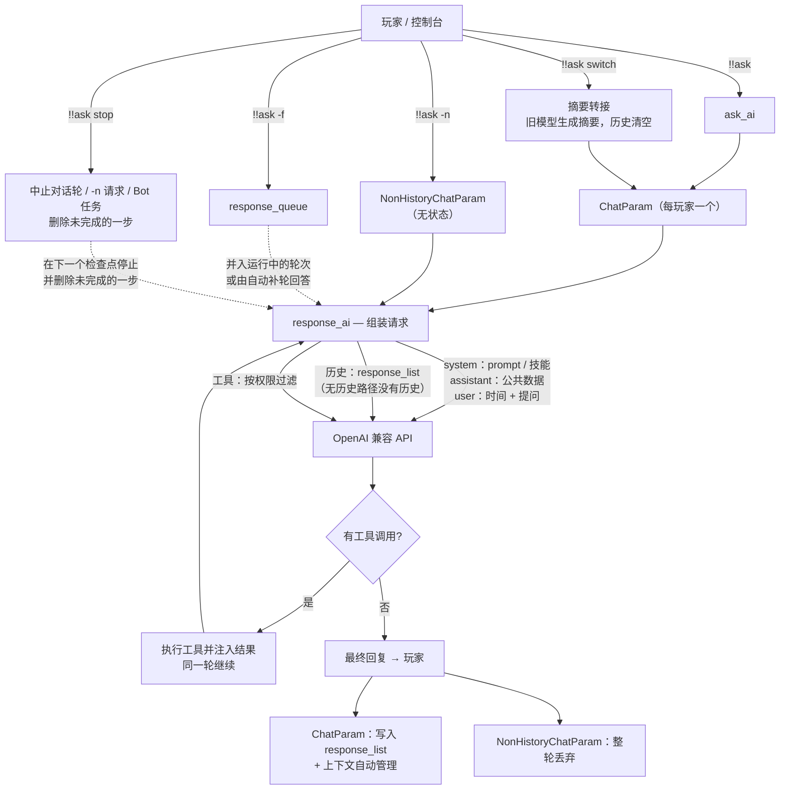

# AI 请求链路与对话机制

[English](../en_us/ai-request-pipeline.md)  |  简体中文  |  [繁體中文](../zh_tw/ai-request-pipeline.md)

[返回 README](../../README.zh-CN.md)

本小节说明从你输入 `!!ask` 到 AI 回复之间发生了什么,以及对话在插件内部是如何管理的。

## 请求链路

1. 执行 `!!ask <content>`(或 `!!ask -n <content>` / `!!ask -f <content>`)。
2. 插件解析你的用户名,构建带 `用户名:` / `消息:` 标签的用户消息(语言随当前语言环境)。
3. 你的**单玩家 `ChatParam` 对象**(见 `games_ai/chat_param.py`)按需惰性创建,使用 `all_ai` / `default_ai` 配置的模型。`!!ask -n` 则改用一次性的 `NonHistoryChatParam`,见[无历史路径](#无历史路径ask--n)。
4. 每一轮,`response_ai` 组装请求:
   - system 消息:该模型的 prompt 与技能列表(内置 + `skills.json` + 外部插件注册),合并为**一条**;
   - 公共数据列表:数据库非空时作为 `assistant` 消息附在其后;
   - 对话历史(无历史路径不保留任何历史),当前时间以 `user` 消息写在提问正前方;
   - 按你的权限等级过滤后的工具列表。
5. 通过 `openai_api.response_chat` 与 OpenAI 兼容 API 通讯:有历史的对象每个 AI 配置持有一个客户端,无历史路径则按 `base_url` + API Key 复用客户端。
6. 若 AI 调用了工具,插件执行之、注入结果,并**在同一轮内继续**,直到 AI 给出最终文本回复。
7. 回复带上 AI 名称前缀发送给你,并写入历史;随后上下文会被自动管理(见[上下文自动管理](#上下文自动管理))。

## 请求里的消息结构

| 顺序 | role | 内容 | 说明 |
|---|---|---|---|
| 1 | `system` | 该模型的 prompt + 技能列表 | **只有一条** |
| 2 | `assistant` | 公共数据列表 | 仅当公共数据库里有内容时才发送 |
| 3… | 任意 | 对话历史 | 期间按需插入 `user` 角色的时间消息 |
| 末 | `user` | 本轮提问 | — |

- **system 只有一条** —— 部分上游(Qwen3.5/3.6/3.8 的 chat template 等)只允许下标 0 是 system,再出现一条就会被拒绝(`System message must be at the beginning`)。因此 prompt 与技能列表用空行合并成一条;它们内容固定,也正是缓存命中的稳定前缀。
- **公共数据用 `assistant`** —— 它是资料而不是命令,所以不做第二条 system;数据库为空时这条消息完全不发送,不会出现一条空的"公共数据列表:"。
- **当前时间用 `user` 消息写在提问正前方** —— 时间每轮都变,放在 system 里会让服务商的前缀缓存从该处起失效(整段历史每轮重新计费)。现在第 1 轮注入一次,之后每 **20 轮**再注入一次,因此相邻两轮之间的提示词前缀完全一致。
- **连续的 `user` 消息在发出前合并成一条** —— 时间 + 提问、技能提示 + 提问、`!!ask -f` 的多条补充、上一轮失败后的重问都会合并:部分上游要求 user/assistant 严格交替,而且模型会把它们当成两轮、只回答最后一条。历史里它们仍各自独立保存,只在请求里合并。
- 例外:历史压缩摘要与切模型转接摘要仍以 `system` 消息注入历史(见下文)。

## 无历史路径(`!!ask -n`)

`!!ask -n <content>` 回答一次提问,不留任何东西。它由 `NonHistoryChatParam` 处理 —— 这是 `games_ai/chat_param.py` 中一个自包含的类,与有历史的对象**不共享任何助手函数、属性或生命周期**。

**它没有的东西:**对话历史(`response_list`)、强制请求队列、轮次生命周期事件、工具计数、上下文管理(token 估算、用量校准、历史压缩与摘要请求),以及任何每玩家状态 —— 不会写入 `all_chat_param`,回答发出后对象即被丢弃。

**与常规路径仍然一致的部分:**

- 相同的消息结构(单条 system:prompt + 技能列表;有数据时的 `assistant` 公共数据;写在提问前的 `user` 时间消息),以及按你权限等级过滤的同一套工具;
- 工具调用仍会被执行并回注,**在同一轮内**继续,直到 AI 给出最终文本回复;
- 相同的回复格式与相同的错误上报(HTTP 状态码映射 + 服务商 Request ID)。

**两点值得知道的差异:**

- **单轮超窗保险** —— 没有历史可压缩,所以请求在发出前只做一次整体测量:若超过模型窗口的 **80%**,则把最新一条消息截断到剩余空间(单轮几乎不可能超窗,但超大工具结果有可能)。完整的[上下文自动管理](#上下文自动管理)只作用于有历史的路径。
- **共享 HTTP 客户端** —— 客户端按 `base_url` + API Key 缓存(最多 8 个),因此连续 `-n` 不必反复重建连接池、重复 TLS 握手。服务商返回的 `usage` 会被读取但不使用:没有历史就没有可校准的对象。

## 上下文自动管理

GamesAI 不再使用固定的 `max_history` 配置。每次请求都会与模型自身的上下文窗口进行比对,只有在确实需要时才压缩对话。

**窗口的来源**(优先级由高到低):

1. `all_ai` 中该 AI 条目的 `context_window` —— 单模型覆盖;
2. 上下文窗口表:从 [`data/context_windows.json`](https://github.com/PengZixuan30/Games_AI/blob/main/data/context_windows.json) 获取(GitHub Raw,jsDelivr 作为第二源),缓存在 `config/games_ai/cache/context_windows.json`,由启动 / 24 小时更新检查链路刷新 —— 执行 `!!gamesai check` 也会刷新,且无视 24 小时 TTL;
3. 随插件版本内置的兜底表(完全离线可用;由仓库 JSON 同步生成的模块 `games_ai/context_table_data.py`);
4. 未知模型使用保守默认值 `32768` token。

**触发条件**(每次请求**之前**与**之后**都会检查):

- 当前上下文达到窗口的 **80%**,或
- 单次请求达到窗口的 **20%**(例如一次读取日志产生的超大工具结果)。

**触发后会发生什么:**

- 最近的 **10 轮**对话始终原样保留(1 轮 = 一条用户消息及其后续 assistant/tool 消息);
- 更早的轮次被替换为一条中性、事实性的**摘要**(用当前模型生成,且不携带工具)。摘要不会模仿此前回复的风格,已有摘要会并入新摘要;
- 若仍然过大,或摘要失败,则先截断超长消息、再丢弃最旧的轮次作为最后的保险 —— 保证下一次请求一定能装得下。

真实输入量取自服务商返回的 `usage` 字段(`prompt_tokens` / `total_tokens`),本地估算会按 `base_url|model` 与之校准,几轮内即可收敛到真实数值。

执行 `!!gamesai debug` 可在 MCDR 控制台看到窗口、用量、校准系数与每一次压缩过程。

## 每玩家状态

- `all_chat_param` 为每个玩家在内存中保留一个 `ChatParam`;`!!gamesai clear` / `!!gamesai clearall` 会删除它们。
- `ChatParam` 拥有:
  - `response_list` — 对话历史;
  - `system_message` — 每轮重建(prompt + 技能列表,单条 system);
  - `response_queue` — `!!ask -f` 等待合并的消息队列;
  - `is_stopped` — 轮次生命周期事件(用于串行化每个玩家的轮次)。
- **`!!ask -n` 不保留任何状态**:它由 `NonHistoryChatParam` 处理,不会注册进 `all_chat_param`,回答发出后即被丢弃 —— 见[无历史路径](#无历史路径ask--n)。
- **`!!ask switch <model>`** 会为你的 `ChatParam` 重建 AI 客户端,并执行**摘要转接**:切换时立即清空原历史,并由旧模型在你**下次提问前**把这段对话压缩成一段中性事实摘要,作为新会话的第一条 system 消息注入。详见[切换模型时的摘要转接](#切换模型时的摘要转接)。
- **`!!ask -f <content>`** 在轮次仍在运行时将请求入队:运行中的轮次会合并它并继续;若轮次恰好在合并前结束,则由自动补轮回答。
- **`!!gamesai debug`** 会将请求流程日志提升到 INFO 级别显示在 MCDR 控制台(请求开始/结束、强制请求入队/合并、工具调用);未开启时同一批日志走 DEBUG 级别。

> [!NOTE]
> **社区投票结果:** [issue #20](https://github.com/PengZixuan30/Games_AI/issues/20) 的投票已结束,采用**方案 B1(摘要转接)**,已在 v0.7.1 实现 —— 新模型的回复不再被上一个模型的风格带偏,同时对话中的事实被保留下来。

## 切换模型时的摘要转接

`!!ask switch <model>` 不是简单地保留或清空对话,而是把**事实**转接过去(方案 **B1**,即 [#20](https://github.com/PengZixuan30/Games_AI/issues/20) 投票选出的方案)。压缩发生的时机与**自动上下文压缩完全一致** —— 在下一次请求之前,而不是在指令执行时:

1. 指令执行时:等待正在运行的轮次结束 → 保存当前对话与旧模型的快照 → 清空原历史 → 为新模型重建客户端与 system 消息。**不发任何 API 请求**,因此即使对话很长,指令也会立即返回;
2. **你下次提问前**(preflight 阶段,与自动压缩同一位置):由**旧模型**对快照做一次中性、事实性的总结 —— 讨论主题、已确认结论、未完成事项、用户明确提出的要求(复用上下文压缩所用的同一条摘要提示词,不带工具,60 秒超时);
3. 摘要作为**新会话的第一条 system 消息**注入,并附上一句提示:让新模型以自己的设定与风格继续,不要模仿上一个模型;
4. 随后正常回答这次提问(上下文中已包含该摘要)。

| 情形 | 行为 | 你会看到 |
|---|---|---|
| 有历史 | 保存快照、清空历史、安排转接 | "……将在你下次提问前由原模型压缩为摘要转接。" |
| 下次请求前转接成功 | 摘要成为第一条 system 消息,本轮照常进行 | 无额外提示(与自动压缩一样),仅调试日志 |
| 转接失败(超时、报错、空回复) | 丢弃旧对话,本轮仍然回答 | "摘要转接失败:上一段对话已丢弃……" |
| 下次提问前又切换了一次 | 保留最初的快照,并由当时生效的模型只总结一次 | 同上 |
| 尚无历史 | 无可转接,永远不发额外请求 | 普通的"已切换"提示 |
| 切换到的就是当前模型 | 什么都不动 | "你当前使用的已经是……" |

补充说明:

- 切换前会等待正在运行的轮次结束,不会对写了一半的对话做快照;
- 切换还会重置该对话的工具计数、强制请求队列与用量/校准计数;
- 摘要请求只在你**真正再次提问时**才产生,每次切换最多一次(超时 60 秒)。它不会阻塞指令,也不会让切换失败;转接失败只是让新对话不带旧上下文;
- `!!ask stop` 不会取消已安排的转接:它属于上一段对话,而不属于运行中的轮次;`!!gamesai clear` 会连同对话对象一起清除它;
- `-n` 路径与此无关:只有带历史的路径才做摘要。见[无历史路径](#无历史路径ask--n)。

## 停止正在进行的对话

`!!ask stop` 会立即中止**你自己**名下所有正在进行的内容:

| 正在进行的内容 | 指令行为 |
|---|---|
| 你的对话轮(模型正在思考,或工具正在执行) | 该轮在下一个检查点停止,未完成的一步从历史中删除,`!!ask -f` 排队消息被丢弃 |
| `!!ask -n` 提问 | 放弃该请求,答案直接丢弃(无状态路径本就不保留任何内容) |
| 你委派给自治 Bot 的任务 | 队列中的任务被移除,正在执行它的循环停止并丢弃已产生的内容 |

"未完成的一步"如何删除:

- 末尾是**工具调用组**(请求工具的 assistant 消息 + 其工具结果)时整组删除,不会残留孤立的 tool 消息;
- 否则删除**该轮追加的全部消息** —— 你的消息、由 `!!ask -f` 合并进来的消息、注入的技能提示 —— 直到上一条已完成的回答为止,等于这次提问从未发生;
- 若该轮已经产出了最终回答,该回答也会被删除。

补充说明:

- 进行中的 HTTP 请求无法真正中断,因此该轮会在下一个检查点停止:下一次请求之前、响应刚返回时,或一批工具调用之间 —— 延迟最多一次请求;
- 该指令只作用于你自己的对话(没有目标参数),也不需要额外权限;
- 当前没有任何进行中的对话时,回复"当前没有进行中的对话。";
- `stop` 必须**恰好是那一个词**才会被当作指令:写成 `!!ask stop it.` 之类的句子会被原样交给 AI(自 0.7.2 起,`!!ask` 由命令分发器解析,见[上下文查看](#上下文查看)一节的说明）。

## 上下文查看

0.7.2 新增三条只读指令,把上下文管理从"看不见"变成"看得见"。三者都不写入任何状态、不启动轮次,因此可以随时执行。

| 指令 | 作用 |
|---|---|
| `!!ask context [玩家]` | 查看某个对话的上下文占用(不填玩家即查看自己) |
| `!!ask context --all` | 按模型汇总全服所有玩家的用量 |
| `!!ask compact` | 忽略窗口触发线,立即压缩较早的历史 |

### 单个对话：`!!ask context [玩家]`

正文只有几行,细节放在悬停里:

- **模型与窗口来源** —— `配置覆盖`(该 AI 条目里的 `context_window`)、`模型表`(内置表/远程表命中)、`默认值`(表里查不到的保守兜底)。窗口来源平时完全不可见,而"覆盖值悄悄压过模型表"正是"窗口看起来不对"的最常见原因;
- **上下文占用** —— 已校准的估算值及占窗口比例;还没有发出过请求时显示"暂无数据";
- **窗口与输出上限** —— 该模型解析出的 `context_window` 与 `max_output`;
- **距离压缩触发还有多少 token**,以及会先撞上哪条线(历史 80% / 突发 20% / 紧急 95%);
- **轮次与消息数**、历史里已有几段摘要、是否带着模型切换的转接摘要,以及 `!!ask -f` 还有几条待并入。

悬停补充:三条触发线的具体 token 数、**逐轮 token 规模**(由旧到新,附占窗口比例,最多 10 行)、**上次请求用量**(输入/输出/合计、缓存命中、推理)与**本轮累计**、**最近一次压缩**的时间与前后消息数。

查看是只读的,但**必须与轮次线程互斥**:轮次进行中会不断追加消息,压缩时整个历史列表会被替换。因此快照在同一把锁下读取,你看到的要么是压缩前、要么是压缩后,不会是写了一半的历史。查看**不会**创建对话对象:从未提问过的玩家会直接得到"没有该玩家的上下文记录"(顺带说明 `!!ask -n` 不保留任何上下文)。

### 全服汇总：`!!ask context --all`

- 按**模型**分组,每个模型一行:人数、当前上下文占用合计与占比、本轮输入合计、本轮峰值合计;
- 悬停显示该模型**自插件加载以来**的累计:输入、输出、合计、缓存命中(0.1% 精度)、推理;
- **零用量的模型不列出**;
- 不显示玩家名,也不限制权限。

两个容易误读的地方:

1. **"当前上下文占用"会缩小** —— 压缩历史或 `!!ask clear` 之后它就会掉下来;想知道"一共花掉多少",看悬停里的累计值;
2. **累计值从本次插件加载开始记** —— 它是内存里的计数器,之前的会话无法追溯,压缩也不会减少它(这正是它存在的意义:压缩会抹掉历史的痕迹,但抹不掉已经花掉的账)。

### 手动压缩：`!!ask compact`

与自动压缩用的是同一套逻辑(同样保留最近 **10 轮**原文,更早的替换为一条中性摘要),区别只在于**忽略触发线**:即使当前远未到 80%,只要你要求就压缩。

它与 `!!ask switch` 的摘要转接一样是**延迟执行**的:指令只登记意图并立即返回,真正的总结请求由你**下次提问**的预检发出。原因是那次总结最长可能耗时 60 秒,放在指令里会卡住服务器主线程;而需要这份小上下文的,正是下一次请求。

因此回复只说"已安排压缩"。另外两种结果同样如实回报:没有可压缩的历史、以及有轮次正在进行(此时拒绝登记 —— 在轮次中途替换历史会把正在进行的工具调用组劈开,请等它结束或先 `!!ask stop`)。

---
