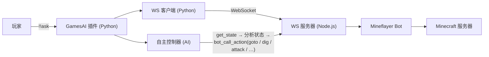

# 使用 Mineflayer Bot

[English](../en_us/mineflayer-bot.md)  |  简体中文  |  [繁體中文](../zh_tw/mineflayer-bot.md)

[返回 README](../../README.zh-CN.md)

GamesAI 0.6.0 引入了基于 [Mineflayer](https://github.com/PrismarineJS/mineflayer) 的全自主 Minecraft 机器人。AI 可以直接控制机器人在游戏世界中寻路、挖掘、建造、合成、战斗和交互。

## 环境要求

- 服务器需安装 **Node.js >= 18** 和 **npm**
- 插件首次启动时自动安装 npm 依赖（`mineflayer`、`ws`、`vec3`、`mineflayer-pathfinder`、`mineflayer-mcefly`），并在已安装的 mineflayer 不支持当前服务器版本时（例如服务器升级后）自动刷新依赖
- 一个用于 Bot 的 Minecraft 账号（Microsoft/Mojang/离线）

## 指令

|指令|用途|
|---|---|
|`!!aibot join`|启用 Bot 并让其加入服务器。|
|`!!aibot leave`|让 Bot 离开服务器并禁用。|
|`!!aibot set <key> <value>`|配置 Bot 身份（`username`/`password`/`auth`）。|

## 工作原理

插件启动一个 Node.js 进程运行 WebSocket 服务器，Python WebSocket 客户端（插件内置）通过本地连接与其通信，形成 MCDR 与 Mineflayer Bot 之间的桥梁。Bot 启动后，**自主 AI 控制器**会定时读取机器人状态、检查聊天消息，并自主决定执行什么操作。

## 支持的操作

Bot 支持 20+ 种操作，通过 `bot_call_action` AI 工具调用：

|操作|描述|
|---|---|
|`goto`|A* 寻路到坐标 `{x, y, z, range?}`|
|`efly`|鞘翅飞行到坐标（需装备鞘翅）|
|`dig`|挖掘指定坐标的方块|
|`place`|在指定坐标放置方块|
|`attack`|按名称攻击附近实体，或攻击最近敌对生物|
|`useOn`|右键实体（如村民交易）|
|`equip` / `unequip`|装备/卸下盔甲或手持物品|
|`mount` / `dismount`|骑乘或离开载具和动物|
|`craft`|合成物品（背包或工作台）|
|`lookAt`|看向坐标或直接设置 yaw/pitch|
|`sleep` / `wake`|在床上睡觉或起床|
|`activateBlock`|右键方块（打开箱子、按下按钮）|
|`setControlState`|控制载具移动（前进/后退/跳跃）|
|`viewContainer` / `takeFromContainer` / `putToContainer`|容器管理|
|`openFurnace` / `furnacePutInput` / `furnacePutFuel` / `furnaceTakeOutput`|熔炉操作|
|`nearbyEntities` / `findBlocks` / `getBlock`|世界查询|
|`stop` / `stopEfly`|停止所有移动或鞘翅飞行|

## Bot 控制 AI 工具

除 `bot_call_action` 外，还有以下专用 AI 工具：

|工具|描述|
|---|---|
|`bot_chat`|让 Bot 在公共聊天中发送消息。|
|`bot_whisper`|让 Bot 向某个玩家发送私聊消息。|
|`bot_get_state`|获取 Bot 完整状态（30+ 字段）。|
|`run_mineflayer_bot` / `stop_mineflayer_bot`|启动或停止 Bot。需要达到配置的 `permission` 权限等级（0.6.4+）。|
|`delegate_to_bot`|将复杂的 Minecraft 任务委派给自主控制器。|

## 配置

完整配置参考见 [5.mineflayer_bot](configuration.md#5mineflayer_bot)。关键要点：

- 将 `mineflayer_bot.enabled` 设为 `true`（或使用 `!!aibot join`）以启动 Bot
- `mineflayer_bot.bot.username` / `password` / `auth` — Bot 的 Minecraft 登录凭据。**用户名必须匹配 `[a-zA-Z0-9_]+`**（仅限英文字母、数字和下划线）。
- `mineflayer_bot.cycle_interval` — 自主 AI 决策间隔（秒）
- `mineflayer_bot.websocket` — 内部设置，除非明确知道用途否则不要修改

> [!NOTE]
> 修改 Bot 配置后，执行 `!!gamesai reload`（或使用 `!!aibot set` / `!!gamesai config set`）即可自动重启 Bot 并应用新配置。详见[热重载](hot-reload.md#热重载)。
