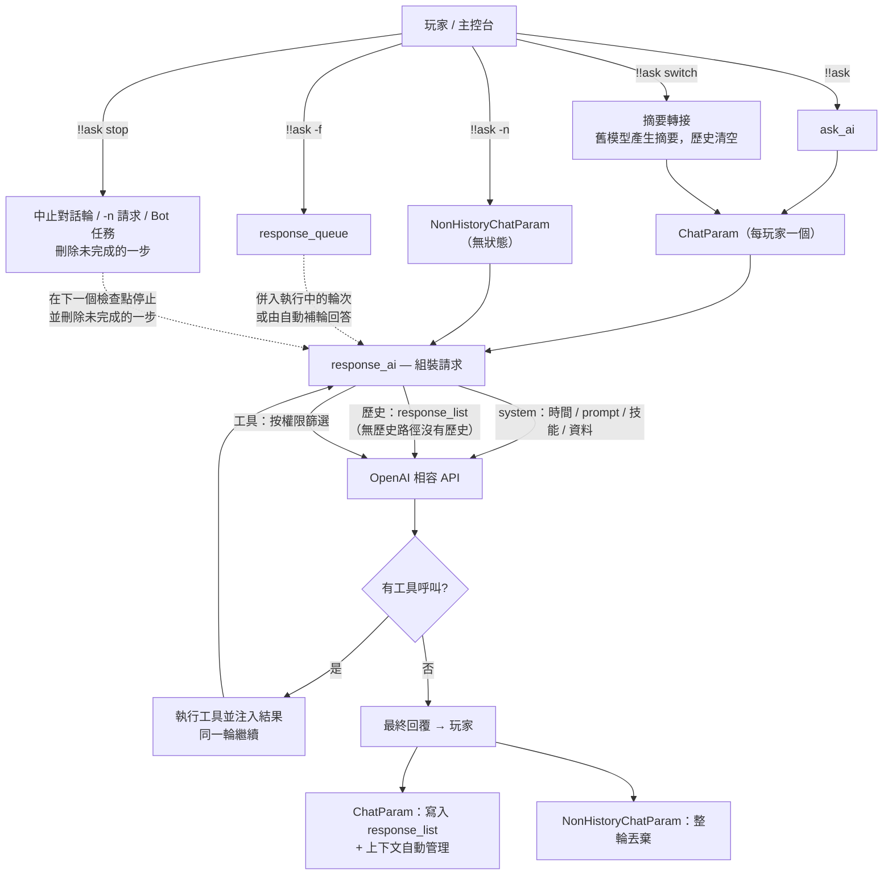

# AI 請求鏈路與對話機制

[English](../en_us/ai-request-pipeline.md)  |  [简体中文](../zh_cn/ai-request-pipeline.md)  |  繁體中文

[返回 README](../../README.zh-TW.md)

本小節說明從你輸入 `!!ask` 到 AI 回覆之間發生了什麼，以及對話在插件內部是如何管理的。

## 請求鏈路

1. 執行 `!!ask <content>`（或 `!!ask -n <content>` / `!!ask -f <content>`）。
2. 插件解析你的使用者名稱，構建帶 `使用者名稱:` / `訊息:` 標籤的使用者訊息（語言隨目前語言環境）。
3. 你的**單玩家 `ChatParam` 物件**（見 `games_ai/chat_param.py`）按需惰性建立，使用 `all_ai` / `default_ai` 設定的模型。`!!ask -n` 則改用一次性的 `NonHistoryChatParam`，見[無歷史路徑](#無歷史路徑ask--n)。
4. 每一輪，`response_ai` 組裝請求：
   - system 訊息：目前時間、該模型的 prompt、技能列表（內建 + `skills.json` + 外部插件註冊）、公共資料列表；
   - 對話歷史（無歷史路徑不保留任何歷史）；
   - 按你的權限等級篩選後的工具列表。
5. 透過 `openai_api.response_chat` 與 OpenAI 相容 API 通訊：有歷史的物件每個 AI 設定持有一個用戶端，無歷史路徑則按 `base_url` + API Key 複用用戶端。
6. 若 AI 呼叫了工具，插件執行之、注入結果，並**在同一輪內繼續**，直到 AI 給出最終文字回覆。
7. 回覆帶上 AI 名稱前綴發送給你，並寫入歷史；隨後上下文會被自動管理（見[上下文自動管理](#上下文自動管理)）。

## 無歷史路徑（`!!ask -n`）

`!!ask -n <content>` 回答一次提問，不留任何東西。它由 `NonHistoryChatParam` 處理 —— 這是 `games_ai/chat_param.py` 中一個自包含的類別，與有歷史的物件**不共享任何輔助函式、屬性或生命週期**。

**它沒有的東西：**對話歷史（`response_list`）、強制請求佇列、輪次生命週期事件、工具計數、上下文管理（token 估算、用量校準、歷史壓縮與摘要請求），以及任何每玩家狀態 —— 不會寫入 `all_chat_param`，回答送出後物件即被丟棄。

**與一般路徑仍然一致的部分：**

- 相同的 system 訊息（時間、prompt、技能列表、公共資料），以及按你權限等級篩選的同一套工具；
- 工具呼叫仍會被執行並回注，**在同一輪內**繼續，直到 AI 給出最終文字回覆；
- 相同的回覆格式與相同的錯誤回報（HTTP 狀態碼對應 + 服務商 Request ID）。

**兩點值得知道的差異：**

- **單輪超窗保險** —— 沒有歷史可壓縮，所以請求在送出前只做一次整體量測：若超過模型視窗的 **80%**，則把最新一則訊息截斷到剩餘空間（單輪幾乎不可能超窗，但超大的工具結果有可能）。完整的[上下文自動管理](#上下文自動管理)只作用於有歷史的路徑。
- **共享 HTTP 用戶端** —— 用戶端按 `base_url` + API Key 快取（最多 8 個），因此連續 `-n` 不必反覆重建連線池、重複 TLS 握手。服務商回傳的 `usage` 會被讀取但不使用：沒有歷史就沒有可校準的對象。

## 上下文自動管理

GamesAI 不再使用固定的 `max_history` 設定。每次請求都會與模型自身的上下文視窗進行比對，只有在確實需要時才壓縮對話。

**視窗的來源**（優先序由高到低）：

1. `all_ai` 中該 AI 條目的 `context_window` —— 單模型覆寫；
2. 上下文視窗表：從 [`data/context_windows.json`](https://github.com/PengZixuan30/Games_AI/blob/main/data/context_windows.json) 取得（GitHub Raw，jsDelivr 作為第二來源），快取於 `config/games_ai/cache/context_windows.json`，由啟動 / 24 小時更新檢查鏈路刷新 —— 執行 `!!gamesai check` 也會刷新，且無視 24 小時 TTL；
3. 隨插件版本內建的備援表（完全離線可用；由倉庫 JSON 同步產生的模組 `games_ai/context_table_data.py`）；
4. 未知模型使用保守預設值 `32768` token。

**觸發條件**（每次請求**之前**與**之後**都會檢查）：

- 目前上下文達到視窗的 **80%**，或
- 單次請求達到視窗的 **20%**（例如一次讀取日誌產生的超大工具結果）。

**觸發後會發生什麼：**

- 最新的 **10 輪**對話始終原樣保留（1 輪 = 一則使用者訊息及其後續 assistant/tool 訊息）；
- 更早的輪次會被替換為一則中性、事實性的**摘要**（用目前模型產生，且不攜帶工具）。摘要不會模仿先前回覆的風格，既有摘要會併入新摘要；
- 若仍然過大，或摘要失敗，則先截斷超長訊息、再丟棄最舊的輪次作為最後保險 —— 保證下一次請求一定能裝得下。

真實輸入量取自服務商回傳的 `usage` 欄位（`prompt_tokens` / `total_tokens`），本地估算會依 `base_url|model` 與之校準，數輪內即可收斂到真實數值。

執行 `!!gamesai debug` 可在 MCDR 主控台看到視窗、用量、校準係數與每一次壓縮過程。

## 每玩家狀態

- `all_chat_param` 為每個玩家在記憶體中保留一個 `ChatParam`；`!!gamesai clear` / `!!gamesai clearall` 會刪除它們。
- `ChatParam` 擁有：
  - `response_list` — 對話歷史；
  - `system_message` — 每輪重建（時間、prompt、技能、資料）；
  - `response_queue` — `!!ask -f` 等待合併的訊息佇列；
  - `is_stopped` — 輪次生命週期事件（用於序列化每個玩家的輪次）。
- **`!!ask -n` 不保留任何狀態**：它由 `NonHistoryChatParam` 處理，不會註冊進 `all_chat_param`，回答送出後即被丟棄 —— 見[無歷史路徑](#無歷史路徑ask--n)。
- **`!!ask switch <model>`** 會為你的 `ChatParam` 重建 AI 用戶端，並執行**摘要轉接**：切換時立即清空原歷史，並由舊模型在你**下次提問前**把這段對話壓縮成一段中性事實摘要，作為新會話的第一條 system 訊息注入。詳見[切換模型時的摘要轉接](#切換模型時的摘要轉接)。
- **`!!ask -f <content>`** 在輪次仍在執行時將請求入隊：執行中的輪次會合併它並繼續；若輪次恰好在合併前結束，則由自動補輪回答。
- **`!!gamesai debug`** 會將請求流程日誌提升到 INFO 等級顯示在 MCDR 主控台（請求開始/結束、強制請求入隊/合併、工具呼叫）；未開啟時同一批日誌走 DEBUG 等級。

> [!NOTE]
> **社群投票結果：** [issue #20](https://github.com/PengZixuan30/Games_AI/issues/20) 的投票已結束，採用**方案 B1（摘要轉接）**，已在 v0.7.1 實作 —— 新模型的回覆不再被上一個模型的風格帶偏，同時對話中的事實被保留下來。

## 切換模型時的摘要轉接

`!!ask switch <model>` 不是單純保留或清空對話，而是把**事實**轉接過去（方案 **B1**，即 [#20](https://github.com/PengZixuan30/Games_AI/issues/20) 投票選出的方案）。壓縮發生的時機與**自動上下文壓縮完全一致** —— 在下一次請求之前，而不是在指令執行時：

1. 指令執行時：等待執行中的輪次結束 → 保存目前對話與舊模型的快照 → 清空原歷史 → 為新模型重建用戶端與 system 訊息。**不發任何 API 請求**，因此即使對話很長，指令也會立即返回；
2. **你下次提問前**（preflight 階段，與自動壓縮同一位置）：由**舊模型**對快照做一次中性、事實性的總結 —— 討論主題、已確認結論、未完成事項、使用者明確提出的要求（沿用上下文壓縮所用的同一條摘要提示詞，不帶工具，60 秒逾時）；
3. 摘要作為**新會話的第一條 system 訊息**注入，並附上一句提示：讓新模型以自己的設定與風格繼續，不要模仿上一個模型；
4. 隨後正常回答這次提問（上下文中已包含該摘要）。

| 情形 | 行為 | 你會看到 |
|---|---|---|
| 有歷史 | 保存快照、清空歷史、安排轉接 | 「……將在你下次提問前由原模型壓縮為摘要轉接。」 |
| 下次請求前轉接成功 | 摘要成為第一條 system 訊息，本輪照常進行 | 無額外提示（與自動壓縮一樣），僅除錯日誌 |
| 轉接失敗（逾時、報錯、空回覆） | 丟棄舊對話，本輪仍然回答 | 「摘要轉接失敗：上一段對話已丟棄……」 |
| 下次提問前又切換了一次 | 保留最初的快照，並由當時生效的模型只總結一次 | 同上 |
| 尚無歷史 | 無可轉接，永遠不發額外請求 | 一般的「已切換」提示 |
| 切換到的就是目前模型 | 什麼都不動 | 「你目前使用的已經是……」 |

補充說明：

- 切換前會等待正在執行的輪次結束，不會對寫了一半的對話做快照；
- 切換還會重置該對話的工具計數、強制請求佇列與用量／校準計數；
- 摘要請求只在你**真正再次提問時**才產生，每次切換最多一次（逾時 60 秒）。它不會阻塞指令，也不會讓切換失敗；轉接失敗只是讓新對話不帶舊上下文；
- `!!ask stop` 不會取消已安排的轉接：它屬於上一段對話，而不屬於執行中的輪次；`!!gamesai clear` 會連同對話物件一起清除它；
- `-n` 路徑與此無關：只有帶歷史的路徑才做摘要。見[無歷史路徑](#無歷史路徑ask--n)。

## 停止正在進行的對話

`!!ask stop` 會立即中止**你自己**名下所有正在進行的內容：

| 正在進行的內容 | 指令行為 |
|---|---|
| 你的對話輪（模型正在思考，或工具正在執行） | 該輪在下一個檢查點停止，未完成的一步從歷史中刪除，`!!ask -f` 佇列訊息被丟棄 |
| `!!ask -n` 提問 | 放棄該請求，答案直接丟棄（無狀態路徑本就不保留任何內容） |
| 你委派給自治 Bot 的任務 | 佇列中的任務被移除，正在執行它的循環停止並丟棄已產生的內容 |

「未完成的一步」如何刪除：

- 末尾是**工具呼叫組**（請求工具的 assistant 訊息 + 其工具結果）時整組刪除，不會殘留孤立的 tool 訊息；
- 否則刪除**該輪追加的全部訊息** —— 你的訊息、由 `!!ask -f` 合併進來的訊息、注入的技能提示 —— 直到上一則已完成的回答為止，等於這次提問從未發生；
- 若該輪已經產出最終回答，該回答也會被刪除。

補充說明：

- 進行中的 HTTP 請求無法真正中斷，因此該輪會在下一個檢查點停止：下一次請求之前、回應剛返回時，或一批工具呼叫之間 —— 延遲最多一次請求；
- 該指令只作用於你自己的對話（沒有目標參數），也不需要額外權限；
- 目前沒有任何進行中的對話時，回覆「目前沒有進行中的對話。」；
- `stop` 必須**恰好是那一個詞**才會被當作指令：寫成 `!!ask stop it.` 之類的句子會被原樣交給 AI（自 0.7.2 起，`!!ask` 由指令分派器解析，見[上下文檢視](#上下文檢視)一節的說明）。

## 上下文檢視

0.7.2 新增三條唯讀指令，把上下文管理從「看不見」變成「看得見」。三者都不寫入任何狀態、不啟動輪次，因此可以隨時執行。

| 指令 | 作用 |
|---|---|
| `!!ask context [玩家]` | 查看某段對話的上下文佔用（不填玩家即查看自己） |
| `!!ask context --all` | 按模型彙總全服所有玩家的用量 |
| `!!ask compact` | 忽略視窗觸發線，立即壓縮較早的歷史 |

### 單一對話：`!!ask context [玩家]`

正文只有幾行，細節放在懸停裡：

- **模型與視窗來源** —— `設定覆寫`（該 AI 條目裡的 `context_window`）、`模型表`（內建表／遠端表命中）、`預設值`（表裡查不到的保守兜底）。視窗來源平時完全不可見，而「覆寫值悄悄壓過模型表」正是「視窗看起來不對」最常見的原因；
- **上下文佔用** —— 已校準的估算值及佔視窗比例；還沒有發出過請求時顯示「暫無資料」；
- **視窗與輸出上限** —— 該模型解析出的 `context_window` 與 `max_output`；
- **距離壓縮觸發還剩多少 token**，以及會先撞上哪條線（歷史 80% / 突發 20% / 緊急 95%）；
- **輪次與訊息數**、歷史裡已有幾段摘要、是否帶著模型切換的轉接摘要，以及 `!!ask -f` 還有幾條待併入。

懸停補充：三條觸發線的具體 token 數、**逐輪 token 規模**（由舊到新，附佔視窗比例，最多 10 行）、**上次請求用量**（輸入／輸出／合計、快取命中、推理）與**本輪累計**、**最近一次壓縮**的時間與前後訊息數。

檢視是唯讀的，但**必須與輪次執行緒互斥**：輪次進行中會不斷追加訊息，壓縮時整個歷史清單會被替換。因此快照在同一把鎖下讀取，你看到的要么是壓縮前、要么是壓縮後，不會是寫了一半的歷史。檢視**不會**建立對話物件：從未提問過的玩家會直接得到「沒有該玩家的上下文記錄」（順帶說明 `!!ask -n` 不保留任何上下文）。

### 全服彙總：`!!ask context --all`

- 按**模型**分組，每個模型一行：人數、目前上下文佔用合計與佔比、本輪輸入合計、本輪峰值合計；
- 懸停顯示該模型**自插件載入以來**的累計：輸入、輸出、合計、快取命中（0.1% 精度）、推理；
- **零用量的模型不列出**；
- 不顯示玩家名，也不限制權限。

兩個容易誤讀的地方：

1. **「目前上下文佔用」會縮小** —— 壓縮歷史或 `!!ask clear` 之後它就會掉下來；想知道「一共花掉多少」，看懸停裡的累計值；
2. **累計值從本次插件載入開始記** —— 它是記憶體裡的計數器，先前的對話無法追溯，壓縮也不會減少它（這正是它存在的意義：壓縮會抹掉歷史的痕跡，但抹不掉已經花掉的帳）。

### 手動壓縮：`!!ask compact`

與自動壓縮用的是同一套邏輯（同樣保留最近 **10 輪**原文，更早的替換為一條中性摘要），區別只在於**忽略觸發線**：即使目前遠未到 80%，只要你要求就壓縮。

它與 `!!ask switch` 的摘要轉接一樣是**延後執行**的：指令只登記意圖並立即返回，真正的總結請求由你**下次提問**的預檢發出。原因是那次總結最長可能耗時 60 秒，放在指令裡會卡住伺服器主執行緒；而需要這份小上下文的，正是下一次請求。

因此回覆只說「已安排壓縮」。另外兩種結果同樣如實回報：沒有可壓縮的歷史、以及有輪次正在進行（此時拒絕登記 —— 在輪次中途替換歷史會把正在進行的工具呼叫組劈開，請等它結束或先 `!!ask stop`）。

---
