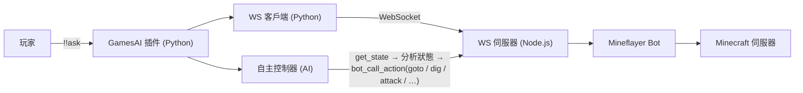

# 使用 Mineflayer Bot

[English](../en_us/mineflayer-bot.md)  |  [简体中文](../zh_cn/mineflayer-bot.md)  |  繁體中文

[返回 README](../../README.zh-TW.md)

GamesAI 0.6.0 引入了基於 [Mineflayer](https://github.com/PrismarineJS/mineflayer) 的全自主 Minecraft 機器人。AI 可以直接控制機器人在遊戲世界中尋路、挖掘、建造、合成、戰鬥和互動。

## 環境需求

- 伺服器需安裝 **Node.js >= 18** 和 **npm**
- 插件首次啟動時自動安裝 npm 依賴（`mineflayer`、`ws`、`vec3`、`mineflayer-pathfinder`、`mineflayer-mcefly`），並在已安裝的 mineflayer 不支援目前伺服器版本時（例如伺服器升級後）自動刷新依賴
- 一個用於 Bot 的 Minecraft 帳號（Microsoft/Mojang/離線）

## 指令

|指令|用途|
|---|---|
|`!!aibot join`|啟用 Bot 並讓其加入伺服器。|
|`!!aibot leave`|讓 Bot 離開伺服器並停用。|
|`!!aibot set <key> <value>`|設定 Bot 身份（`username`/`password`/`auth`）。|

## 工作原理

插件啟動一個 Node.js 程序執行 WebSocket 伺服器，Python WebSocket 客戶端（插件內建）透過本地連線與其通訊，形成 MCDR 與 Mineflayer Bot 之間的橋樑。Bot 啟動後，**自主 AI 控制器**會定時讀取機器人狀態、檢查聊天訊息，並自主決定執行什麼操作。

## 支援的操作

Bot 支援 20+ 種操作，透過 `bot_call_action` AI 工具呼叫：

|操作|描述|
|---|---|
|`goto`|A* 尋路到座標 `{x, y, z, range?}`|
|`efly`|鞘翅飛行到座標（需裝備鞘翅）|
|`dig`|挖掘指定座標的方塊|
|`place`|在指定位址放置方塊|
|`attack`|按名稱攻擊附近實體，或攻擊最近敵對生物|
|`useOn`|右鍵實體（如村民交易）|
|`equip` / `unequip`|裝備/卸下盔甲或手持物品|
|`mount` / `dismount`|騎乘或離開載具和動物|
|`craft`|合成物品（背包或工作台）|
|`lookAt`|看向座標或直接設定 yaw/pitch|
|`sleep` / `wake`|在床上睡覺或起床|
|`activateBlock`|右鍵方塊（打開儲物箱、按下按鈕）|
|`setControlState`|控制載具移動（前進/後退/跳躍）|
|`viewContainer` / `takeFromContainer` / `putToContainer`|容器管理|
|`openFurnace` / `furnacePutInput` / `furnacePutFuel` / `furnaceTakeOutput`|熔爐操作|
|`nearbyEntities` / `findBlocks` / `getBlock`|世界查詢|
|`stop` / `stopEfly`|停止所有移動或鞘翅飛行|

## Bot 控制 AI 工具

除 `bot_call_action` 外，還有以下專用 AI 工具：

|工具|描述|
|---|---|
|`bot_chat`|讓 Bot 在公共聊天中傳送訊息。|
|`bot_whisper`|讓 Bot 向某個玩家傳送私聊訊息。|
|`bot_get_state`|取得 Bot 完整狀態（30+ 欄位）。|
|`run_mineflayer_bot` / `stop_mineflayer_bot`|啟動或停止 Bot。需要達到設定的 `permission` 權限等級（0.6.4+）。|
|`delegate_to_bot`|將複雜的 Minecraft 任務委派給自主控制器。|

## 設定

完整設定參考見 [5.mineflayer_bot](configuration.md#5mineflayer_bot)。關鍵要點：

- 將 `mineflayer_bot.enabled` 設為 `true`（或使用 `!!aibot join`）以啟動 Bot
- `mineflayer_bot.bot.username` / `password` / `auth` — Bot 的 Minecraft 登入憑證。**使用者名稱必須匹配 `[a-zA-Z0-9_]+`**（僅限英文字母、數字和底線）。
- `mineflayer_bot.cycle_interval` — 自主 AI 決策間隔（秒）
- `mineflayer_bot.websocket` — 內部設定，除非明確知道用途否則不要修改

> [!NOTE]
> 修改 Bot 設定後，執行 `!!gamesai reload`（或使用 `!!aibot set` / `!!gamesai config set`）即可自動重啟 Bot 並套用新設定。詳見[熱重載](hot-reload.md#熱重載)。
